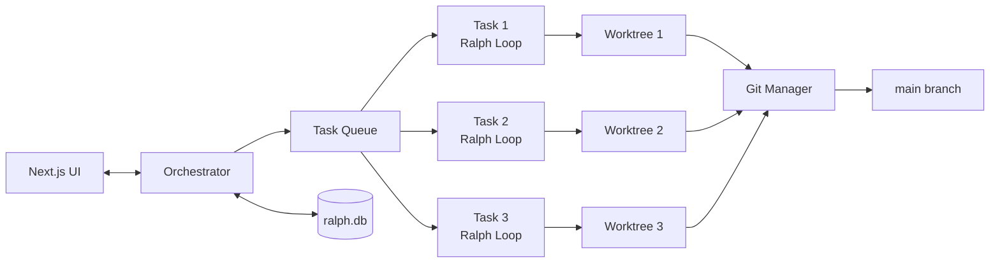
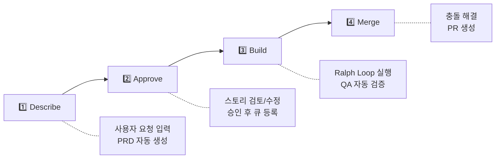

# PRD: Ralph Web Platform (The Ultimate Fusion)

## 1. 개요 (Introduction)

**Ralph Web**은 기존 네 가지 강력한 도구의 장점을 하나로 결합한 통합 AI 코딩 플랫폼입니다:

| 도구            | 역할   | 핵심 기능                                                  |
| --------------- | ------ | ---------------------------------------------------------- |
| **Ralph**       | 두뇌   | 재귀적 "생각-코딩-검증" 루프, Fresh Context                |
| **Auto-Claude** | 근육   | Git Worktree 격리, QA Loop, Graphiti 메모리, Spec Pipeline |
| **1code**       | 얼굴   | 깔끔한 UI, Sub-Chat 세션 관리, MCP 캐싱                    |
| **emdash**      | 팔다리 | Provider-Agnostic (20+ CLI), Issue Tracker 통합            |

이 플랫폼은 "아이디어에서 PR까지(Idea to PR)"의 워크플로우를 구조화되고 시각적인 프로세스로 변환합니다.

---

## 2. 핵심 철학 (Core Philosophy)

### Ralph Core (from Geoffrey Huntley)

- **Fresh Context Per Iteration**: 매 반복마다 새로운 AI 인스턴스 생성
- **Memory via Files, Not State**: 메모리는 `progress.txt`, `prd.json`, `AGENTS.md`를 통해서만 전달
- **Small, Focused Stories**: 하나의 컨텍스트 윈도우 내에서 완료 가능한 크기

### Ralph-Web 확장

- **1 Task = 1 Ralph Loop = 1 Git Worktree**: 태스크별 완전 격리
- **3-Level Memory**: Project → Task → Worktree 계층적 메모리
- **Parallel Execution**: 여러 태스크 동시 실행

---

## 3. 아키텍처 요약 (Architecture Summary)

> 📌 상세 내용: [specs/architecture.md](./specs/architecture.md)



**핵심 원칙:**
| 구분 | Ralph (단일) | Ralph-Web (다중) |
|------|-------------|------------------|
| 태스크 상태 | `tasks/prd.json` | `.ralph/ralph.db` (중앙 DB) |
| 작업 공간 | 프로젝트 루트 | `.worktrees/{task-id}/` (격리) |
| 병렬 실행 | 불가 | 태스크별 독립 루프 |

---

## 4. 워크플로우: "Idea to PR"



---

## 5. 사용자 스토리 (User Stories)

> 📌 상세 내용: [specs/user-stories.md](./specs/user-stories.md)

### 기존 스토리 (Ralph 기반)

| ID     | 제목                       | Phase    |
| ------ | -------------------------- | -------- |
| US-001 | 프로젝트 스캐폴딩          | P0       |
| US-002 | Git Worktree 격리 및 병합  | P0       |
| US-003 | 에이전트 어댑터 구현       | P0       |
| US-004 | Ralph Loop & Self-QA       | P0       |
| US-005 | 확장된 미션 컨트롤 UI      | P1       |
| US-006 | 영속적 기억 (Memory Layer) | P0/P2/P3 |
| US-007 | Fresh Context 아키텍처     | P0       |
| US-008 | 자동 아카이빙 시스템       | P1       |
| US-009 | 브라우저 검증 통합         | P1       |
| US-010 | 완료 신호 및 종료 조건     | P0       |
| US-011 | 다중 태스크 병렬 관리      | P1       |
| US-012 | 태스크 상태 데이터베이스   | P1       |

### 신규 스토리 (1code, Auto-Claude, emdash 기반)

| ID     | 제목                            | Phase | 출처                |
| ------ | ------------------------------- | ----- | ------------------- |
| US-013 | **Spec Creation Pipeline**      | P2    | Auto-Claude         |
| US-014 | **QA Loop (Reviewer → Fixer)**  | P1    | Auto-Claude         |
| US-015 | **Multi-Agent Registry**        | P2    | emdash              |
| US-016 | **Sub-Chat/Session Resume**     | P2    | 1code               |
| US-017 | **E2E Testing Integration**     | P2    | Auto-Claude         |
| US-018 | **MCP 서버 상태 캐싱**          | P2    | 1code               |
| US-019 | **Issue Tracker 통합**          | P3    | emdash, Auto-Claude |
| US-020 | **Security Model (3계층 보안)** | P1    | Auto-Claude         |
| US-021 | **Visual Context (Screenshot)** | P2    | Auto-Claude         |
| US-022 | **Agent Usage Tracking**        | P2    | Auto-Claude         |
| US-023 | **Git Attribution Config**      | P2    | 1code               |

---

## 6. 기술 스펙 (Technical Specifications)

### 관련 문서

- [Architecture Spec](./specs/architecture.md) - 시스템 구조, 컴포넌트, 파일 구조
- [UI Spec](./specs/ui-spec.md) - 페이지 레이아웃, 컴포넌트 시스템, 디자인 가이드
- [User Stories](./specs/user-stories.md) - 전체 사용자 스토리 상세
- [Memory System](./specs/memory-system.md) - 3단계 메모리 계층, 파일 포맷
- [Database Schema](./specs/database-schema.md) - SQLite 스키마, 동기화 전략

### 기술 스택

| Layer    | Tech                                                                  |
| -------- | --------------------------------------------------------------------- |
| Frontend | Next.js 16 (App Router), React 19, shadcn UI (Base UI + Tailwind CSS) |
| Backend  | Node.js, Socket.io, tRPC                                              |
| Database | SQLite (Drizzle ORM), Vector Embeddings (Phase 3)                     |
| State    | Zustand (client), Files (persistence)                                 |
| AI       | Multi-Provider Registry (Claude, Amp, Gemini, Qwen...)                |
| Testing  | Playwright (E2E), Vitest (Unit)                                       |

### Project Structure

```text
ralph-web/
├── src/                  # Main source code
│   ├── app/              # Next.js App Router (i18n: en/ko)
│   ├── components/       # UI Components
│   ├── lib/              # Core Logic (Orchestrator, Worktree, Store, etc.)
│   ├── hooks/            # Shared React hooks
│   ├── i18n/             # i18n Configuration
│   ├── messages/         # Translation files (en/ko)
│   └── stories/          # Storybook component stories
├── public/               # Static assets
├── tasks/                # Project Specs & Roadmap
└── AGENTS.md             # Technical guide for agents
```

### JSON Schema

- [prd.schema.json](./prd.schema.json) - PRD 구조 검증

---

## 7. 구현 로드맵 (Implementation Roadmap)

### Phase 1: MVP (단일 태스크, Ralph 호환)

- US-001, US-002, US-003, US-004, US-006 Phase 1, US-007, US-010
- **목표**: 단일 태스크 Ralph Loop 동작

### Phase 2: 다중 태스크 + Enhanced UX

- **US-011**, **US-012**, US-005, US-008, US-009
- **목표**: 병렬 태스크 실행, 칸반 UI

### Phase 3: Advanced Memory & Agent

- US-006 Phase 3 (Graphiti 스타일 그래프 메모리)
- **US-015** (Multi-Agent Registry)
- **US-016** (Sub-Chat/Session Resume)
- **US-017** (E2E Testing Integration)
- **US-018** (MCP 서버 상태 캐싱)
- Memory Explorer UI
- **목표**: 그래프 메모리, 다중 Provider 지원, 세션 재개

### Phase 4: Ecosystem Integration

- **US-019** (Issue Tracker 통합: Linear, Jira, GitHub Issues)
- Changelog 자동 생성
- **목표**: 외부 도구 통합, 팀 협업 지원

### Phase 5-7: 현재 개발 단계 (세분화)

> 📌 상세 내용: [PRIORITIES.md](./PRIORITIES.md)

| Phase    | 이름               | 설명                                                  |
| -------- | ------------------ | ----------------------------------------------------- |
| Phase 7  | Agent Orchestrator | `child_process` 기반 에이전트 연결 및 실시간 스트리밍 |
| Phase 8  | Worktree Manager   | `git worktree` 격리 환경 구축                         |
| Phase 9  | Memory & Persistence | 지능형 지식 그래프, 코드 인덱싱 및 DB 통합 영속화     |
| Phase 10 | Queue Manager      | 병렬 태스크 스케줄링 및 리소스 제어                   |
| Phase 11 | QA Loop (Fixer)    | 자동 테스트 연동 및 에러 피드백 루프                  |
| Phase 12 | Multi-Agent        | 20+ CLI 에이전트 표준 어댑터 확장                     |

---

## 8. 성공 지표 (Success Metrics)

| 지표          | 목표                                  |
| ------------- | ------------------------------------- |
| 완료율        | 사용자 개입 없이 완료되는 스토리 80%+ |
| 반복 효율     | 평균 < 3 반복/스토리                  |
| 메모리 활용도 | 이전 패턴 참조로 해결된 문제 비율     |
| 병렬 처리량   | 동시 3+ Ralph Loop 실행               |

---

## 9. 보강된 기능 (Enhanced Features from Analysis)

> 1code, Auto-Claude, emdash 분석에서 도출된 핵심 기능

| 기능                       | 설명                                                   | 출처                |
| -------------------------- | ------------------------------------------------------ | ------------------- |
| **Spec Creation Pipeline** | 복잡도(SIMPLE/STANDARD/COMPLEX)에 따른 동적 파이프라인 | Auto-Claude         |
| **QA Loop**                | Planner → Coder → QA Reviewer → QA Fixer 순환          | Auto-Claude         |
| **Graphiti Memory**        | 그래프 DB + 시맨틱 검색 기반 지식 저장                 | Auto-Claude         |
| **Multi-Agent**            | 20+ CLI 에이전트 지원 (Claude, Gemini, Qwen, Amp...)   | emdash              |
| **Sub-Chat/Session**       | Task 내 다중 세션, sessionId 기반 재개                 | 1code               |
| **MCP 캐싱**               | MCP 서버 상태 디스크 캐시 (TTL 기반)                   | 1code               |
| **E2E Testing**            | Playwright/Electron MCP 통합 자동 UI 검증              | Auto-Claude         |
| **Issue Tracker**          | Linear, Jira, GitHub Issues 양방향 동기화              | emdash, Auto-Claude |
| **Security Model**         | 3계층 보안 (OS Sandbox, Filesystem, Command Allowlist) | Auto-Claude         |
| **File Preservation**      | Worktree 생성 시 .env 등 환경 파일 자동 보존           | emdash              |
| **Visual Context**         | 태스크 생성 시 화면 캡처 및 이미지 컨텍스트 전달       | Auto-Claude         |
| **Usage Tracking**         | 에이전트별 토큰 사용량 및 비용 추적 API                | Auto-Claude         |
| **Git Attribution**        | Co-authored-by 서명 자동 관리 및 설정 옵션             | 1code               |
| **Auth Expiry Alert**      | API 키/토큰 만료 시 선제적 경고 모달 (Silent Fail 방지)| Auto-Claude         |

---

## 10. 제약 사항 (Constraints)

- **로컬 실행**: 사용자 머신에서 실행 (`git`, `claude` CLI 필요)
- **동시성**: 최대 동시 에이전트 수 설정 가능 (기본: 3)
- **API 제한**: 속도 제한 고려한 스케줄링
