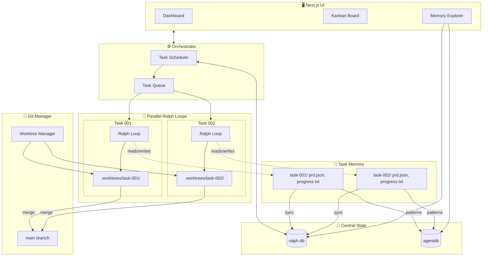
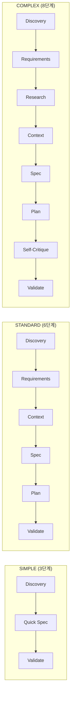
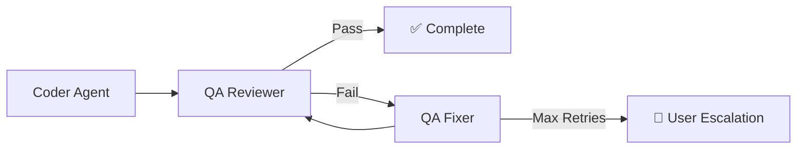

# Architecture Specification

> 📌 Part of [PRD: Ralph Web Platform](../prd-ralph-web.md)

## 시스템 구조도 (System Overview)



---

## 태스크별 Ralph Loop 격리 (Per-Task Isolation)

**핵심 개념: 1 Task = 1 Ralph Loop = 1 Git Worktree**

```
┌─────────────────────────────────────────────────────────────────────────┐
│  Task "dark-mode" (task-001)                                            │
├─────────────────────────────────────────────────────────────────────────┤
│                                                                         │
│  Git Worktree: .worktrees/task-001/          ← 에이전트 작업 공간       │
│  ├── src/                                     (실제 코드 변경)           │
│  ├── package.json                                                       │
│  └── AGENTS.md                               ← 워크트리별 학습 내용      │
│                                                                         │
│  Metadata: .ralph/tasks/task-001/            ← Ralph 상태 파일          │
│  ├── prd.json                                 (이 태스크의 스토리)       │
│  ├── progress.txt                             (이 태스크의 로그)         │
│  └── memory/                                  (이 태스크의 인사이트)     │
│                                                                         │
│  Branch: ralph/dark-mode                     ← 독립된 Git 브랜치        │
│                                                                         │
│  Ralph Loop: [Iteration 1] → [Iteration 2] → ... → [COMPLETE]          │
│              ↓                                                          │
│              Fresh AI instance each time                                │
│              Reads: prd.json, progress.txt, AGENTS.md                   │
│              Tools: consult_memory (AgentDB)                            │
│              Works in: .worktrees/task-001/                             │
│                                                                         │
└─────────────────────────────────────────────────────────────────────────┘
```

**에이전트 실행 시 경로 주입:**

```bash
# 오케스트레이터가 각 태스크의 에이전트를 시작할 때
TASK_ID=task-001
WORKTREE_PATH=.worktrees/$TASK_ID
METADATA_PATH=.ralph/tasks/$TASK_ID

# 에이전트는 Worktree 경로에서 실행
cd $WORKTREE_PATH && amp --prompt "$(cat $METADATA_PATH/prompt.md)"
```

---

## 핵심 컴포넌트 (Core Components)

### 1. 오케스트레이터 (Backend)

- 모든 활성 작업의 상태를 관리합니다.
- "Ralph Loop" 상태 머신을 구현합니다.
- 작업 큐(Job Queue)를 처리합니다 (AutoClaude 스타일).
- **QA 파이프라인**: 빌드 및 테스트 실패 시 자동 롤백 및 재시도 로직 관리.

### 2. Git Worktree 매니저

- 단순히 디렉토리를 이동(`cd`)하는 대신 `git worktree add/remove`를 관리합니다.
- 각 에이전트가 완벽히 격리된 파일 시스템 환경에서 실행되도록 보장합니다.
- `git push` 및 PR 생성을 담당합니다.
- **Merge Agent**: 충돌 발생 시 AI를 호출하여 해결을 시도합니다.

### 3. 에이전트 어댑터 (Agent Adapters)

- 다양한 AI CLI 도구를 위한 공통 인터페이스입니다.
- 입력(Prompt)과 출력(Stream/Logs)을 표준화합니다.
- 기능 감지(도구 지원 여부, Thinking 지원 여부 등)를 처리합니다.

### 4. UI (Frontend)

- **칸반 보드**: 할 일(To Do) / 진행 중(In Progress) / 검토(Review) / 완료(Done).
- **로드맵 & 아이디어**: 장기적인 기능 계획 및 브레인스토밍 공간.
- **인사이트 & 컨텍스트**: 코드베이스 이해도 시각화 및 에이전트 메모리 탐색.
- **에이전트 터미널**: 에이전트의 CLI 출력을 실시간 스트리밍.

### 5. Spec Creation Pipeline (Auto-Claude 기반)

복잡도에 따른 동적 파이프라인:



### 6. QA Loop 시스템 (Auto-Claude 기반)

구현 완료 후 자동 검증 순환:



**출력물:**

- `qa_report.md` - QA 검증 결과
- `QA_FIX_REQUEST.md` - 수정 요청 사항 (실패 시)

### 7. Multi-Provider Registry (emdash 기반)

다양한 CLI 에이전트 표준화:

```typescript
interface ProviderDefinition {
  id: string; // 'claude', 'amp', 'gemini', 'qwen'
  name: string; // 'Claude Code'
  cli: string; // 'claude'
  installCommand: string; // 'npm install -g @anthropic-ai/claude-code'
  autoApproveFlag?: string; // '--dangerously-skip-permissions'
  resumeFlag?: string; // '-c -r'
  planActivateCommand?: string; // '/plan'
  icon?: string; // 'claude.png'
}
```

**지원 Provider (초기):**
| Provider | CLI | Auto-Approve Flag |
|----------|-----|-------------------|
| Claude Code | `claude` | `--dangerously-skip-permissions` |
| Amp | `amp` | (없음) |
| Gemini | `gemini` | `--yolomode` |
| Qwen Code | `qwen` | `--yolo` |

## 파일 시스템 구조 (File System Structure)

**다중 태스크 병렬 실행을 위한 격리된 구조** (Auto-Claude 스타일 참고):

```
ralph-web/
├── src/
│   ├── app/             # Next.js App Router (en/ko)
│   ├── components/      # UI Components (dashboard, kanban, wizard, settings, etc.)
│   ├── lib/             # Core Logic
│   │   ├── orchestrator/ # Agent loops, PTY runner, Provider interface
│   │   ├── worktree/    # Git Worktree logic, File preservation
│   │   ├── store/       # Zustand stores
│   │   ├── prd/         # PRD generation & schema
│   │   ├── review/      # Review process & Diff utils
│   │   ├── tasks/       # Task domain logic
│   │   └── types.ts     # Shared Types
│   ├── hooks/           # Custom React hooks
│   ├── i18n/            # i18n routing and request logic
│   ├── messages/        # Translation JSON files (en/ko)
│   └── stories/         # Storybook component stories
├── public/              # Static assets
├── tests/               # Playwright E2E tests
├── .worktrees/          # (Gitignored) Isolated agent workspace
├── .ralph/              # (Gitignored) Task metadata & SQLite DB
└── AGENTS.md            # Technical guide for agents and developers
```

**핵심 원칙:**
| 구분 | Ralph (단일) | Ralph-Web (다중) |
|------|-------------|------------------|
| 태스크 상태 | `tasks/prd.json` | `.ralph/ralph.db` (중앙 DB) |
| 진행 로그 | `tasks/progress.txt` | `.ralph/tasks/{id}/progress.txt` (격리) |
| 작업 공간 | 프로젝트 루트 | `.worktrees/{task-id}/` (격리) |
| 패턴 공유 | `progress.txt` 상단 | `agentdb` (ReasoningBank) |
| 병렬 실행 | 불가 | 태스크별 독립 루프 |
