# Architecture Specification

> 📌 Part of [PRD: Ralph Web Platform](../prd-ralph-web.md)

## 시스템 구조도 (System Overview)

```mermaid
flowchart TB
    subgraph UI["🖥️ Next.js UI"]
        Dashboard[Dashboard]
        Kanban[Kanban Board]
        MemoryExplorer[Memory Explorer]
    end

    subgraph Orchestrator["⚙️ Orchestrator"]
        TaskScheduler[Task Scheduler]
        TaskQueue[Task Queue]
    end

    subgraph ParallelTasks["🔄 Parallel Ralph Loops"]
        subgraph Task1["Task 001"]
            RL1[Ralph Loop]
            WT1[".worktrees/task-001/"]
        end
        subgraph Task2["Task 002"]
            RL2[Ralph Loop]
            WT2[".worktrees/task-002/"]
        end
    end

    subgraph GitManager["🌿 Git Manager"]
        MainBranch[main branch]
        Worktrees[Worktree Manager]
    end

    subgraph CentralState["💾 Central State"]
        DB[(ralph.db)]
        GlobalPatterns[global-patterns.md]
    end

    subgraph TaskMemory["📁 Task Memory"]
        TM1["task-001/ prd.json, progress.txt"]
        TM2["task-002/ prd.json, progress.txt"]
    end

    UI <--> Orchestrator
    TaskScheduler --> TaskQueue
    TaskQueue --> Task1 & Task2

    RL1 --> WT1
    RL2 --> WT2

    RL1 -.->|reads/writes| TM1
    RL2 -.->|reads/writes| TM2

    Worktrees --> WT1 & WT2
    WT1 & WT2 -->|merge| MainBranch

    TaskScheduler <--> DB
    TM1 & TM2 -->|sync| DB
    TM1 & TM2 -->|patterns| GlobalPatterns

    MemoryExplorer --> DB & GlobalPatterns
```



---

## 태스크별 Ralph Loop 격리 (Per-Task Isolation)

**핵심 개념: 1 Task = 1 Ralph Loop = 1 Git Worktree**

```
┌─────────────────────────────────────────────────────────────────────────┐
│  Task "dark-mode" (task-001)                                            │
├─────────────────────────────────────────────────────────────────────────┤
│                                                                         │
│  Git Worktree: .worktrees/task-001/          ← 에이전트 작업 공간       │
│  ├── src/                                     (실제 코드 변경)           │
│  ├── package.json                                                       │
│  └── AGENTS.md                               ← 워크트리별 학습 내용      │
│                                                                         │
│  Metadata: .ralph/tasks/task-001/            ← Ralph 상태 파일          │
│  ├── prd.json                                 (이 태스크의 스토리)       │
│  ├── progress.txt                             (이 태스크의 로그)         │
│  └── memory/                                  (이 태스크의 인사이트)     │
│                                                                         │
│  Branch: ralph/dark-mode                     ← 독립된 Git 브랜치        │
│                                                                         │
│  Ralph Loop: [Iteration 1] → [Iteration 2] → ... → [COMPLETE]          │
│              ↓                                                          │
│              Fresh AI instance each time                                │
│              Reads: prd.json, progress.txt, AGENTS.md                   │
│              Works in: .worktrees/task-001/                             │
│                                                                         │
└─────────────────────────────────────────────────────────────────────────┘
```

**에이전트 실행 시 경로 주입:**

```bash
# 오케스트레이터가 각 태스크의 에이전트를 시작할 때
TASK_ID=task-001
WORKTREE_PATH=.worktrees/$TASK_ID
METADATA_PATH=.ralph/tasks/$TASK_ID

# 에이전트는 Worktree 경로에서 실행
cd $WORKTREE_PATH && amp --prompt "$(cat $METADATA_PATH/prompt.md)"
```

---

## 핵심 컴포넌트 (Core Components)

### 1. 오케스트레이터 (Backend)

- 모든 활성 작업의 상태를 관리합니다.
- "Ralph Loop" 상태 머신을 구현합니다.
- 작업 큐(Job Queue)를 처리합니다 (AutoClaude 스타일).
- **QA 파이프라인**: 빌드 및 테스트 실패 시 자동 롤백 및 재시도 로직 관리.

### 2. Git Worktree 매니저

- 단순히 디렉토리를 이동(`cd`)하는 대신 `git worktree add/remove`를 관리합니다.
- 각 에이전트가 완벽히 격리된 파일 시스템 환경에서 실행되도록 보장합니다.
- `git push` 및 PR 생성을 담당합니다.
- **Merge Agent**: 충돌 발생 시 AI를 호출하여 해결을 시도합니다.

### 3. 에이전트 어댑터 (Agent Adapters)

- 다양한 AI CLI 도구를 위한 공통 인터페이스입니다.
- 입력(Prompt)과 출력(Stream/Logs)을 표준화합니다.
- 기능 감지(도구 지원 여부, Thinking 지원 여부 등)를 처리합니다.

### 4. UI (Frontend)

- **칸반 보드**: 할 일(To Do) / 진행 중(In Progress) / 검토(Review) / 완료(Done).
- **로드맵 & 아이디어**: 장기적인 기능 계획 및 브레인스토밍 공간.
- **인사이트 & 컨텍스트**: 코드베이스 이해도 시각화 및 에이전트 메모리 탐색.
- **에이전트 터미널**: 에이전트의 CLI 출력을 실시간 스트리밍.

### 5. Spec Creation Pipeline (Auto-Claude 기반)

복잡도에 따른 동적 파이프라인:

```mermaid
flowchart LR
    subgraph SIMPLE["SIMPLE (3단계)"]
        S1[Discovery] --> S2[Quick Spec] --> S3[Validate]
    end

    subgraph STANDARD["STANDARD (6단계)"]
        T1[Discovery] --> T2[Requirements] --> T3[Context]
        T3 --> T4[Spec] --> T5[Plan] --> T6[Validate]
    end

    subgraph COMPLEX["COMPLEX (8단계)"]
        C1[Discovery] --> C2[Requirements] --> C3[Research]
        C3 --> C4[Context] --> C5[Spec] --> C6[Plan]
        C6 --> C7[Self-Critique] --> C8[Validate]
    end
```



### 6. QA Loop 시스템 (Auto-Claude 기반)

구현 완료 후 자동 검증 순환:

```mermaid
flowchart LR
    Coder[Coder Agent] --> QAR[QA Reviewer]
    QAR -->|Pass| Done[✅ Complete]
    QAR -->|Fail| QAF[QA Fixer]
    QAF --> QAR
    QAF -->|Max Retries| Escalate[🚨 User Escalation]
```



**출력물:**

- `qa_report.md` - QA 검증 결과
- `QA_FIX_REQUEST.md` - 수정 요청 사항 (실패 시)

### 7. Multi-Provider Registry (emdash 기반)

다양한 CLI 에이전트 표준화:

```typescript
interface ProviderDefinition {
  id: string; // 'claude', 'amp', 'gemini', 'qwen'
  name: string; // 'Claude Code'
  cli: string; // 'claude'
  installCommand: string; // 'npm install -g @anthropic-ai/claude-code'
  autoApproveFlag?: string; // '--dangerously-skip-permissions'
  resumeFlag?: string; // '-c -r'
  planActivateCommand?: string; // '/plan'
  icon?: string; // 'claude.png'
}
```

**지원 Provider (초기):**
| Provider | CLI | Auto-Approve Flag |
|----------|-----|-------------------|
| Claude Code | `claude` | `--dangerously-skip-permissions` |
| Amp | `amp` | (없음) |
| Gemini | `gemini` | `--yolomode` |
| Qwen Code | `qwen` | `--yolo` |

## 파일 시스템 구조 (File System Structure)

**다중 태스크 병렬 실행을 위한 격리된 구조** (Auto-Claude 스타일 참고):

```
ralph-web/
├── src/
│   ├── app/                 # Next.js App Router
│   ├── components/          # UI Components
│   ├── lib/
│   │   ├── agents/          # Agent Adapters
│   │   ├── git-manager.ts   # Worktree Logic & Merge
│   │   ├── orchestrator.ts  # The Ralph Loop & QA
│   │   ├── task-manager.ts  # 다중 태스크 상태 관리
│   │   └── types.ts         # Shared Types
│   └── server/              # Socket.io Server
├── .worktrees/              # (Gitignored) 태스크별 격리된 작업 공간
│   ├── task-001/            # Task 001의 Git Worktree
│   ├── task-002/            # Task 002의 Git Worktree (병렬 실행)
│   └── task-003/
├── .ralph/                  # Ralph-Web 메타데이터 (Gitignored)
│   ├── ralph.db             # SQLite: 전체 태스크 상태 중앙 관리
│   ├── global-patterns.md   # 프로젝트 전역 Codebase Patterns
│   └── tasks/               # 태스크별 격리된 디렉토리
│       ├── task-001/
│       │   ├── prd.json     # 이 태스크의 스토리 목록
│       │   ├── progress.txt # 이 태스크의 진행 로그
│       │   └── memory/      # 이 태스크의 인사이트
│       ├── task-002/
│       │   ├── prd.json
│       │   ├── progress.txt
│       │   └── memory/
│       └── archive/         # 완료된 태스크 아카이브
└── AGENTS.md                # 에이전트가 자동 업데이트하는 학습 내용
```

**핵심 원칙:**
| 구분 | Ralph (단일) | Ralph-Web (다중) |
|------|-------------|------------------|
| 태스크 상태 | `tasks/prd.json` | `.ralph/ralph.db` (중앙 DB) |
| 진행 로그 | `tasks/progress.txt` | `.ralph/tasks/{id}/progress.txt` (격리) |
| 작업 공간 | 프로젝트 루트 | `.worktrees/{task-id}/` (격리) |
| 패턴 공유 | `progress.txt` 상단 | `.ralph/global-patterns.md` + DB |
| 병렬 실행 | 불가 | 태스크별 독립 루프 |
