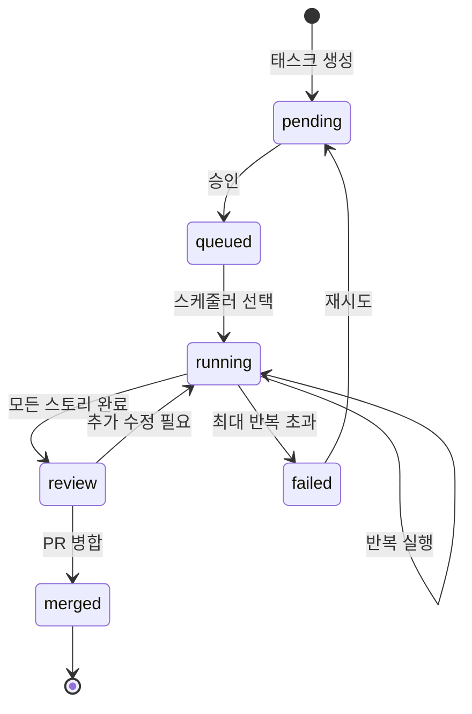

# Database Schema Specification

> 📌 Part of [PRD: Ralph Web Platform](../prd-ralph-web.md)

---

## 개요

Ralph-Web은 **파일 기반 메모리**를 Source of Truth로 사용하되, **SQLite**를 검색/UI 최적화용 보조 저장소로 활용합니다.

```
.ralph/ralph.db  ← 중앙 상태 데이터베이스
```

---

## 테이블 스키마

### tasks (태스크 테이블)

각 기능/PRD 단위를 관리합니다.

```sql
CREATE TABLE tasks (
  id TEXT PRIMARY KEY,              -- 'task-001', 'task-002'
  name TEXT NOT NULL,               -- '다크 모드 추가'
  description TEXT,
  branch_name TEXT NOT NULL,        -- 'ralph/dark-mode'
  status TEXT DEFAULT 'pending',    -- pending, queued, running, review, merged, failed
  priority INTEGER DEFAULT 0,       -- 높을수록 먼저 실행
  current_iteration INTEGER DEFAULT 0,
  max_iterations INTEGER DEFAULT 10,
  worktree_path TEXT,               -- '.worktrees/task-001/'
  metadata_path TEXT,               -- '.ralph/tasks/task-001/'
  created_at DATETIME DEFAULT CURRENT_TIMESTAMP,
  updated_at DATETIME DEFAULT CURRENT_TIMESTAMP,
  started_at DATETIME,
  completed_at DATETIME
);
```

**상태 생명주기:**



---

### stories (스토리 테이블)

태스크 내 개별 작업 단위를 관리합니다.

```sql
CREATE TABLE stories (
  id TEXT NOT NULL,                 -- 'US-001' (태스크 내에서 고유)
  task_id TEXT NOT NULL REFERENCES tasks(id) ON DELETE CASCADE,
  title TEXT NOT NULL,
  description TEXT,
  acceptance_criteria TEXT,         -- JSON array
  priority INTEGER DEFAULT 1,       -- 태스크 내 우선순위
  passes BOOLEAN DEFAULT FALSE,
  thread_url TEXT,                  -- Amp/Claude 스레드 URL
  iteration_completed INTEGER,      -- 완료된 반복 번호
  started_at DATETIME,
  completed_at DATETIME,
  PRIMARY KEY (task_id, id)
);
```

---

### patterns (패턴 테이블)

학습된 Codebase Patterns를 관리합니다.

```sql
CREATE TABLE patterns (
  id INTEGER PRIMARY KEY AUTOINCREMENT,
  task_id TEXT REFERENCES tasks(id) ON DELETE SET NULL,  -- NULL이면 글로벌 패턴
  pattern TEXT NOT NULL,
  category TEXT,                    -- 'convention', 'gotcha', 'tip'
  source_file TEXT,                 -- 발견된 파일 경로
  created_at DATETIME DEFAULT CURRENT_TIMESTAMP,
  promoted_at DATETIME              -- global로 승격된 시간
);
```

**카테고리:**
| 카테고리 | 설명 | 예시 |
|---------|------|------|
| `convention` | 코드 컨벤션 | "Component naming: PascalCase" |
| `gotcha` | 주의사항 | "Always use IF NOT EXISTS for migrations" |
| `tip` | 유용한 팁 | "Use --dangerously-allow-all for autonomous mode" |

---

### iterations (반복 로그 테이블)

각 Ralph Loop 반복의 로그를 저장합니다.

```sql
CREATE TABLE iterations (
  id INTEGER PRIMARY KEY AUTOINCREMENT,
  task_id TEXT NOT NULL REFERENCES tasks(id) ON DELETE CASCADE,
  iteration_number INTEGER NOT NULL,
  story_id TEXT,                    -- 작업한 스토리 ID
  status TEXT,                      -- 'success', 'failed', 'timeout'
  thread_url TEXT,
  duration_seconds INTEGER,
  error_message TEXT,
  files_changed TEXT,               -- JSON array
  created_at DATETIME DEFAULT CURRENT_TIMESTAMP
);
```

---

### sessions (세션 테이블) - 1code 기반

Task 내 다중 Sub-Chat/Session을 관리합니다.

```sql
CREATE TABLE sessions (
  id TEXT PRIMARY KEY,
  task_id TEXT NOT NULL REFERENCES tasks(id) ON DELETE CASCADE,
  name TEXT,                        -- '첫 번째 시도', '수정 후 재시도'
  session_id TEXT,                  -- Claude SDK 세션 ID
  stream_id TEXT,                   -- 진행중 스트림 ID
  mode TEXT DEFAULT 'agent',        -- 'plan' | 'agent'
  messages TEXT DEFAULT '[]',       -- JSON array
  created_at DATETIME DEFAULT CURRENT_TIMESTAMP,
  updated_at DATETIME DEFAULT CURRENT_TIMESTAMP
);
```

---

### providers (Provider 테이블) - emdash 기반

Multi-Provider Registry를 관리합니다.

```sql
CREATE TABLE providers (
  id TEXT PRIMARY KEY,              -- 'claude', 'amp', 'gemini', 'qwen'
  name TEXT NOT NULL,               -- 'Claude Code'
  cli TEXT NOT NULL,                -- 'claude'
  install_command TEXT,             -- 'npm install -g @anthropic-ai/claude-code'
  auto_approve_flag TEXT,           -- '--dangerously-skip-permissions'
  initial_prompt_flag TEXT,
  resume_flag TEXT,                 -- '-c -r'
  plan_activate_command TEXT,       -- '/plan'
  icon TEXT,                        -- 'claude.png'
  is_installed BOOLEAN DEFAULT FALSE,
  installed_version TEXT,
  last_checked_at DATETIME
);
```

---

### mcp_status (MCP 상태 캐시 테이블) - 1code 기반

MCP 서버 상태를 캐시합니다.

```sql
CREATE TABLE mcp_status (
  id INTEGER PRIMARY KEY AUTOINCREMENT,
  project_path TEXT NOT NULL,
  server_name TEXT NOT NULL,
  status TEXT,                      -- 'running', 'failed', 'needs-auth'
  cached_at DATETIME DEFAULT CURRENT_TIMESTAMP,
  UNIQUE(project_path, server_name)
);
```

---

### qa_reports (QA 리포트 테이블) - Auto-Claude 기반

QA Loop 결과를 저장합니다.

```sql
CREATE TABLE qa_reports (
  id INTEGER PRIMARY KEY AUTOINCREMENT,
  task_id TEXT NOT NULL REFERENCES tasks(id) ON DELETE CASCADE,
  iteration_number INTEGER NOT NULL,
  status TEXT,                      -- 'passed', 'failed', 'fixed'
  acceptance_criteria_results TEXT, -- JSON: [{criterion, passed, notes}]
  build_output TEXT,
  test_output TEXT,
  fix_request TEXT,                 -- QA_FIX_REQUEST 내용
  screenshots TEXT,                 -- JSON array of paths
  created_at DATETIME DEFAULT CURRENT_TIMESTAMP
);
```

---

## 인덱스

```sql
-- 태스크 조회 최적화
CREATE INDEX idx_tasks_status ON tasks(status);
CREATE INDEX idx_tasks_priority ON tasks(priority DESC);
CREATE INDEX idx_tasks_created ON tasks(created_at DESC);

-- 스토리 조회 최적화
CREATE INDEX idx_stories_task ON stories(task_id);
CREATE INDEX idx_stories_passes ON stories(task_id, passes);

-- 패턴 조회 최적화
CREATE INDEX idx_patterns_task ON patterns(task_id);
CREATE INDEX idx_patterns_category ON patterns(category);
CREATE INDEX idx_patterns_global ON patterns(task_id) WHERE task_id IS NULL;

-- 반복 로그 조회 최적화
CREATE INDEX idx_iterations_task ON iterations(task_id, iteration_number);

-- 세션 조회 최적화 (신규)
CREATE INDEX idx_sessions_task ON sessions(task_id);
CREATE INDEX idx_sessions_session_id ON sessions(session_id);

-- MCP 상태 조회 최적화 (신규)
CREATE INDEX idx_mcp_status_project ON mcp_status(project_path);
CREATE INDEX idx_mcp_status_cached ON mcp_status(cached_at);

-- QA 리포트 조회 최적화 (신규)
CREATE INDEX idx_qa_reports_task ON qa_reports(task_id, iteration_number);
CREATE INDEX idx_qa_reports_status ON qa_reports(status);
```

---

## 동기화 전략

### 파일 → DB (단방향)

```typescript
// 파일 변경 감지 시 DB 업데이트
async function syncTaskFromFiles(taskId: string) {
  const metadataPath = `.ralph/tasks/${taskId}`;

  // prd.json 읽기
  const prd = await readJson(`${metadataPath}/prd.json`);

  // DB 업데이트
  await db
    .update(tasks)
    .set({
      name: prd.project,
      branch_name: prd.branchName,
      updated_at: new Date(),
    })
    .where(eq(tasks.id, taskId));

  // 스토리 동기화
  for (const story of prd.userStories) {
    await db
      .insert(stories)
      .values({
        id: story.id,
        task_id: taskId,
        title: story.title,
        passes: story.passes,
        // ...
      })
      .onConflictDoUpdate({
        target: [stories.task_id, stories.id],
        set: { passes: story.passes },
      });
  }
}
```

### DB 손상 시 복구

```typescript
// 파일에서 전체 DB 재구축
async function rebuildDatabase() {
  const taskDirs = await readdir(".ralph/tasks");

  for (const taskId of taskDirs) {
    if (taskId === "archive") continue;
    await syncTaskFromFiles(taskId);
  }
}
```

---

## 쿼리 예시

### 실행 대기 중인 태스크 조회

```sql
SELECT * FROM tasks
WHERE status IN ('pending', 'queued')
ORDER BY priority DESC, created_at ASC
LIMIT 1;
```

### 미완료 스토리 조회

```sql
SELECT s.*, t.name as task_name
FROM stories s
JOIN tasks t ON s.task_id = t.id
WHERE s.passes = FALSE AND t.status = 'running'
ORDER BY s.priority ASC;
```

### 글로벌 패턴 조회

```sql
SELECT * FROM patterns
WHERE task_id IS NULL
ORDER BY created_at DESC;
```

### 태스크 완료율 통계

```sql
SELECT
  t.id,
  t.name,
  COUNT(*) as total_stories,
  SUM(CASE WHEN s.passes THEN 1 ELSE 0 END) as completed_stories,
  ROUND(100.0 * SUM(CASE WHEN s.passes THEN 1 ELSE 0 END) / COUNT(*), 1) as completion_rate
FROM tasks t
JOIN stories s ON t.id = s.task_id
GROUP BY t.id;
```
