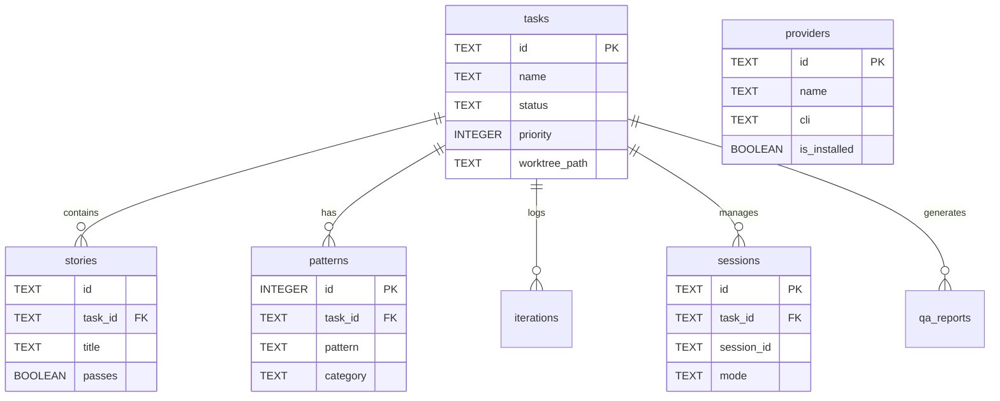
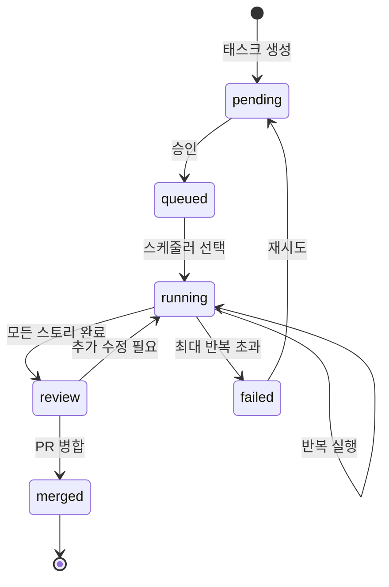

# Database Schema Specification

> 📌 Part of [PRD: Ralph Web Platform](../prd-ralph-web.md)

---

## 개요

Ralph-Web은 **파일 기반 메모리**를 Source of Truth로 사용하되, **SQLite**를 검색/UI 최적화용 보조 저장소로 활용합니다.

```
.ralph/ralph.db  ← 중앙 상태 데이터베이스
```

---

## 상세 문서

| 문서                          | 설명                                                                                                   |
| ----------------------------- | ------------------------------------------------------------------------------------------------------ |
| [📄 Tables](./db/tables.md)   | 테이블 스키마 정의 (tasks, stories, patterns, iterations, sessions, providers, mcp_status, qa_reports) |
| [📄 Queries](./db/queries.md) | 인덱스, 동기화 전략, 주요 쿼리 예시                                                                    |

---

## 테이블 요약

| 테이블       | 설명                     | 출처        |
| ------------ | ------------------------ | ----------- |
| `tasks`      | 기능/PRD 단위 관리       | Core        |
| `stories`    | 태스크 내 작업 단위      | Core        |
| `patterns`   | 학습된 Codebase Patterns | Core        |
| `iterations` | Ralph Loop 반복 로그     | Core        |
| `sessions`   | Sub-Chat/Session 관리    | 1code       |
| `providers`  | Multi-Provider Registry  | emdash      |
| `mcp_status` | MCP 서버 상태 캐시       | 1code       |
| `qa_reports` | QA Loop 결과             | Auto-Claude |

---

## ERD (Entity Relationship Diagram)



---

## 상태 생명주기


