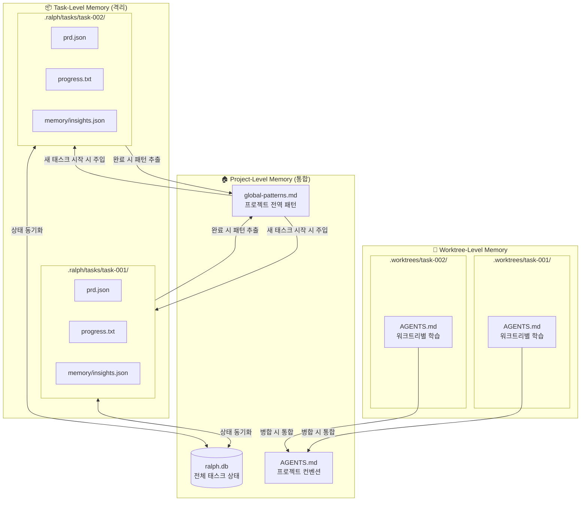
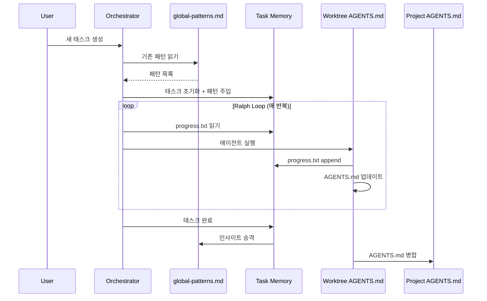
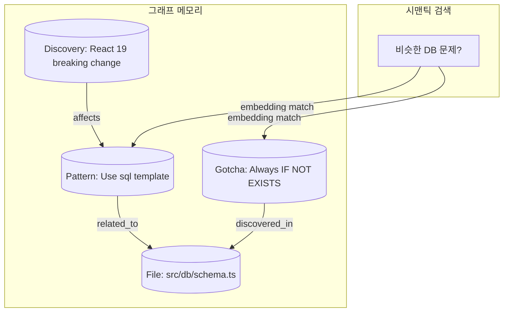
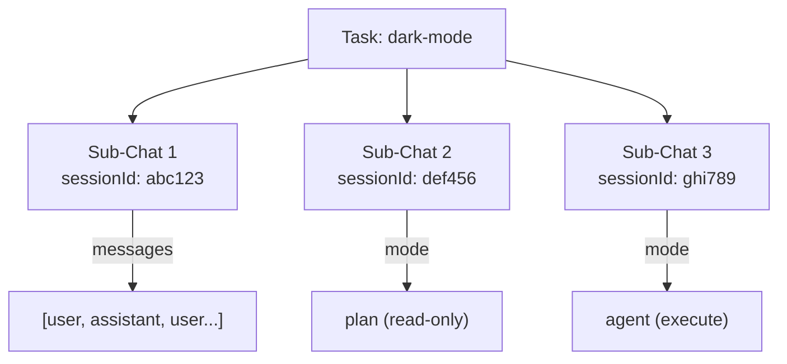

# Memory System Specification

> 📌 Part of [PRD: Ralph Web Platform](../prd-ralph-web.md)

---

## 3단계 메모리 계층 (Three-Level Memory Hierarchy)



---

## 메모리 계층별 역할

| 계층               | 위치                 | 용도                         | 생명주기        |
| ------------------ | -------------------- | ---------------------------- | --------------- |
| **Project-Level**  | `.ralph/`, 루트      | 전체 태스크 상태, 공유 패턴  | 프로젝트 전체   |
| **Task-Level**     | `.ralph/tasks/{id}/` | 개별 태스크의 PRD, 진행 로그 | 태스크 완료까지 |
| **Worktree-Level** | `.worktrees/{id}/`   | 실행 중 발견한 코드 패턴     | 병합 시 통합    |

---

## 메모리 흐름



**단계별 설명:**

1. **태스크 시작**: `global-patterns.md` 읽어서 프롬프트에 주입
2. **반복 실행 중**: `progress.txt`에 append, Worktree `AGENTS.md` 업데이트
3. **태스크 완료**: 태스크 인사이트 → `global-patterns.md`로 승격
4. **병합 시**: Worktree `AGENTS.md` → 프로젝트 `AGENTS.md`로 통합

---

## 파일 포맷

### progress.txt 구조

```
## Codebase Patterns  ← 상단에 통합된 재사용 가능 패턴
- Use `sql<number>` template for aggregations
- Always use `IF NOT EXISTS` for migrations
---

## [Date/Time] - [Story ID]
Thread: https://ampcode.com/threads/$THREAD_ID  ← 이전 작업 참조용
- What was implemented
- Files changed
- **Learnings for future iterations:**
  - Patterns discovered
  - Gotchas encountered
---
```

### global-patterns.md 구조

```markdown
# Global Codebase Patterns

> 프로젝트 전역에서 발견된 재사용 가능한 패턴들

## Conventions

- Use `sql<number>` template for aggregations
- Component naming: PascalCase for React components

## Gotchas

- Always use `IF NOT EXISTS` for migrations
- Don't forget to update types.ts when changing API

## Tips

- Use `--dangerously-allow-all` for Amp autonomous mode
- Check AGENTS.md in the directory before making changes

---

_Last updated: 2025-01-21 by task-003_
```

---

## 왜 파일 기반을 기본으로 하는가?

| 이유                    | 설명                                                  |
| ----------------------- | ----------------------------------------------------- |
| **Fresh Context 제약**  | 매 반복마다 새 AI 프로세스 → in-memory 상태 유지 불가 |
| **AI 도구 호환성**      | Claude/Amp는 파일 읽기가 네이티브 기능                |
| **Git 통합**            | 커밋/diff/히스토리 추적 가능, 롤백 용이               |
| **Zero Infrastructure** | DB 서버 없이 로컬에서 즉시 동작                       |
| **Human-readable**      | 사람이 직접 확인/수정/디버깅 가능                     |

---

## SQLite는 검색/UI용 보조 저장소

```
┌─────────────────────────────────────────────────────────┐
│  파일 (Source of Truth)                                 │
│  - 에이전트가 직접 읽고 씀                                │
│  - Git으로 버전 관리                                     │
│  - Human-readable                                       │
└─────────────────────────────────────────────────────────┘
                         ↓ 단방향 동기화 (백그라운드)
┌─────────────────────────────────────────────────────────┐
│  SQLite (검색 최적화)                                    │
│  - 태스크 필터링/정렬                                     │
│  - 패턴 검색                                             │
│  - UI Dashboard 데이터 소스                              │
└─────────────────────────────────────────────────────────┘
```

**Phase 2 확장 (벡터 임베딩):**

- 패턴/인사이트를 임베딩하여 의미 기반 검색 지원
- "비슷한 버그 어떻게 해결했지?" 같은 쿼리 가능
- Memory Explorer UI에서 탐색

---

## Phase 3: Graphiti 스타일 그래프 메모리 (Auto-Claude 기반)

> 단순 키-값이 아닌 **관계 기반 지식 그래프** 저장



**Graphiti Memory 특징:**
| 기능 | 설명 |
|------|------|
| 그래프 DB | 엔티티와 관계 저장 (LadybugDB 또는 SQLite FTS5) |
| 시맨틱 검색 | 임베딩 기반 유사도 검색 |
| 세션 인사이트 | 패턴, gotchas, discoveries 자동 추출 |
| Multi-Provider | OpenAI, Anthropic, Ollama 임베딩 지원 |

**저장 위치:**

```
.ralph/tasks/{task-id}/graphiti/
├── nodes.json      # 노드 정보
├── edges.json      # 관계 정보
└── embeddings.bin  # 벡터 임베딩
```

---

## Sub-Chat/Session 관리 (1code 기반)

> Task 내 다중 시도(세션) 추적 및 재개



**세션 테이블 구조:**

```sql
CREATE TABLE sessions (
  id TEXT PRIMARY KEY,
  task_id TEXT NOT NULL REFERENCES tasks(id),
  session_id TEXT,        -- Claude SDK 세션 ID
  mode TEXT DEFAULT 'agent',  -- 'plan' | 'agent'
  messages TEXT,          -- JSON array
  created_at DATETIME DEFAULT CURRENT_TIMESTAMP,
  updated_at DATETIME DEFAULT CURRENT_TIMESTAMP
);
```

**세션 재개 흐름:**

1. 이전 세션 선택
2. `sessionId`로 Claude SDK resumeConversation 호출
3. 이전 메시지 히스토리 렌더링
4. 새 메시지부터 이어서 대화

---

## MCP 서버 상태 캐싱 (1code 기반)

> MCP 서버 상태를 디스크에 캐시하여 앱 재시작 후에도 유지

**캐시 파일:** `.ralph/cache/mcp-status.json`

```json
{
  "version": 1,
  "entries": {
    "/project/path": {
      "servers": {
        "context7": { "status": "running", "cachedAt": 1705849200000 },
        "grep": { "status": "failed", "cachedAt": 1705849200000 }
      },
      "updatedAt": 1705849200000
    }
  }
}
```

**캐시 정책:**
| 항목 | 값 |
|------|-----|
| TTL | 5분 (300,000ms) |
| 갱신 시점 | 앱 시작, 수동 새로고침, TTL 만료 |
| 필터링 | `failed`, `needs-auth` 서버 자동 제외 |
