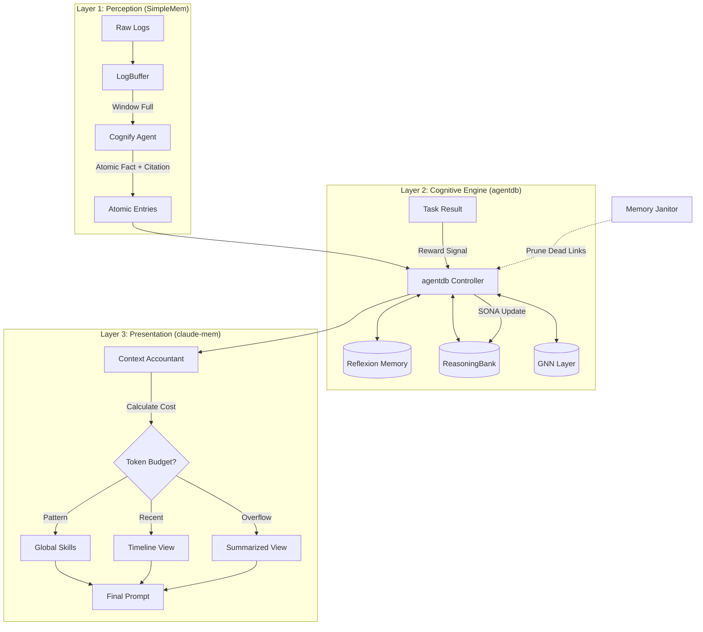

# Phase 9: Memory System Overview

> **Enterprise-Ready Cognitive Architecture**
>
> Phase 8 완료 후, `agentdb` (powered by `ruvector` & `SONA`)를 핵심 두뇌로 하는 자율 학습형 메모리 시스템을 구축합니다.

---

## 핵심 분석 및 전략 (Analysis & Strategy)

벤치마크 레포지토리(`SimpleMem`, `memU`, `ruvector`, `agentic-flow`) 분석 결과, 다음과 같은 통합 전략을 수립했습니다.

| 컴포넌트 | 역할 | 벤치마크 (Source) | Ralph-Web 적용 전략 |
| :--- | :--- | :--- | :--- |
| **Cognify Middleware** | **Input Purity** | **SimpleMem** | 로그 저장 전 **LLM 기반 모호성 제거(Disambiguation)** 필수. "그거 고쳐줘" -> "User fixed auth error". |
| **Cognitive Engine** | **Brain & Storage** | **agentdb (SONA)** | 직접 DB를 짜지 않고 `agentdb`의 **ReasoningBank**와 **GNN**을 그대로 사용. Trajectory Learning 자동화. |
| **Context Accountant** | **Presentation** | **claude-mem** | 무조건적인 Top-k 검색 대신, **토큰 예산(Token Budget)** 기반의 경제적 컨텍스트 구성 (Summary vs Detail). |
| **Provenance** | **Trust** | **memU** | 모든 메모리는 **Citation(출처)**을 가져야 함. DB 스키마 레벨에서 강제. |
| **Memory Janitor** | **Maintenance** | **Insight** | 코드 삭제 시 관련 기억을 정리하는 **Concept Drift** 관리 프로세스 도입. |

---

## 아키텍처 (The "Active Brain" Model)

단순 저장소가 아니라, 에이전트가 행동할 때마다 스스로 학습하는 구조입니다.

---

## 핵심 기능 상세

### 1. ECL Pipeline (Extract-Cognify-Load)
*   **SimpleMem Insight**: 쓰레기 데이터(Garbage In)를 막는 것이 벡터 DB 성능보다 중요합니다.
*   **Action**: `libs/memory/src/pipeline/cognify.ts`에서 Raw Log를 `Atomic Fact`로 변환하는 전처리기를 구현합니다. (Prompt: `prompts/memory/cognify.md`)

### 2. ReasoningBank & SONA (agentdb Native)
*   **RuVector Insight**: `agentdb`는 이미 성공/실패 궤적을 학습하는 `ReasoningBank`를 내장하고 있습니다.
*   **Action**: 별도의 학습 로직을 짜지 않고, QA 테스트 결과(Pass/Fail)를 `agentdb.recordOutcome()`에 연결하여 자동으로 똑똑해지게 만듭니다.

### 3. Context Budgeting (claude-mem Style)
*   **Claude-Mem Insight**: 검색된 모든 정보를 다 주면 토큰 낭비입니다. 중요도에 따라 정보를 압축합니다.
*   **Action**: `libs/memory/src/retrieval/accountant.ts`에서 `Reasoning Patterns`(최우선) -> `Recent Failures`(차선) -> `Old Episodes`(요약) 순으로 예산을 배분합니다.

### 4. Memory Janitor (Concept Drift)
*   **New Insight**: 코드가 삭제되거나 리팩토링되면, 과거의 "파일 경로" 기반 기억은 환각(Hallucination)이 됩니다.
*   **Action**: 주기적으로(Nightly) `git diff`를 분석하여, 사라진 파일과 연결된 메모리를 `archived` 처리하거나 `deprecated` 태그를 붙이는 백그라운드 잡을 실행합니다.

---

## 구현 로드맵 (Updated)

1.  **Foundation**: `agentdb` 인스턴스화 및 `memU` 스타일 Citation 스키마 적용.
2.  **Input**: `LogBuffer` 및 `Cognify` 구현 (SimpleMem).
3.  **Output**: `ContextAccountant` 구현 (claude-mem).
4.  **Loop Integration**: QA 결과 -> ReasoningBank 연결 (Self-Learning).
5.  **Maintenance**: Memory Janitor 구현.

---

## 참조 문서
- [05-ecl-pipeline.md](./05-ecl-pipeline.md): Cognify 프롬프트 및 파이프라인 상세.
- [03-retrieval.md](./03-retrieval.md): Context Budgeting 전략.
