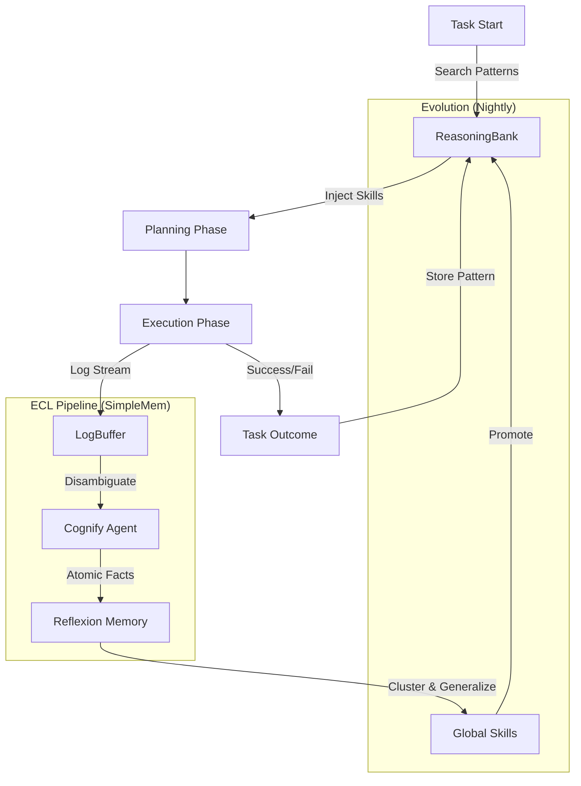

# Memory System Architecture

## Unified Server Architecture

> [!NOTE]
> **서버 전용 아키텍처**: 브라우저는 DB를 사용하지 않으며, 모든 메모리 로직은 API 서버(Node.js)에서 실행됩니다.
> **agentdb**를 단순 저장소가 아닌, 에이전트의 **'자율 학습 엔진(Cognitive Engine)'**으로 활용합니다.

```
┌─────────────────────────────────────────────────────────────────────────┐
│                       UNIFIED SERVER STACK                              │
├─────────────────┬─────────────────┬─────────────────┬───────────────────┤
│    Component    │   Technology    │      Role       │       Notes       │
├─────────────────┼─────────────────┼─────────────────┼───────────────────┤
│ **App DB**      │ pglite (Drizzle)│ App Data Only   │ Settings, Sessions│
│ **Cognitive DB**│ agentdb         │ Active Memory   │ Skills, Patterns  │
│ **Vector**      │ RuVector        │ Semantic Search │ via agentdb       │
│ **Graph**       │ CausalGraph     │ Relationships   │ via agentdb       │
└─────────────────┴─────────────────┴─────────────────┴───────────────────┘
```

---

## 1. Core Philosophy: The Intelligence Loop

메모리 시스템은 단순한 아카이브가 아닙니다. 작업 전/후로 `ReasoningBank`와 상호작용하며 스스로 똑똑해지는 **순환 루프(Loop)** 입니다.



---

## 2. Selected Stack & Roles

### 2.1 AgentDB (The Cognitive Engine)
단순 CRUD가 아닌, `agentic-flow`의 **ReasoningBank** 기능을 전적으로 활용합니다.

*   **Reflexion Memory (Episodic)**: "지난번에 A를 시도했다가 에러 B가 났다." (구체적 사실)
*   **ReasoningBank (Semantic)**: "인증 구현 시엔 JWT보다 Session이 낫더라." (일반화된 패턴)
*   **CausalGraph (Relational)**: "에러 B는 라이브러리 C 버전 문제였다." (인과 관계)

### 2.2 App DB (The Application State)
웹 애플리케이션으로서 필요한 상태를 관리합니다.

*   **Tasks & Stories**: PRD, 진행 상태.
*   **User Settings**: 테마, 언어, API 키.

---

## 3. Integration Strategy

`agentdb`의 `createDatabase()` 팩토리를 래핑하여 `RalphMemoryService`를 구축합니다.

```typescript
// libs/memory/src/service.ts

export class RalphMemoryService {
  private agentdb: AgentDB;

  constructor(config: MemoryConfig) {
    this.agentdb = createDatabase({
      path: config.agentDbPath,
      vectorBackend: "ruvector",
      features: {
        enableGNN: true, // GNN 학습 활성화 (RuVector)
        gnnLayers: 3,
      },
    });
  }

  /**
   * 1. Task Start: 과거 성공 패턴 검색 (ReasoningBank)
   */
  async retrieveContext(taskDescription: string): Promise<Context> {
    // 성공했던 패턴 검색 (Confidence > 0.8)
    const patterns = await this.agentdb.reasoningBank.searchPatterns({
      task: taskDescription,
      minReward: 0.8,
      limit: 3
    });
    
    // 관련 에피소드(사실) 검색
    const episodes = await this.agentdb.reflexion.search(taskDescription);
    
    return { patterns, episodes };
  }

  /**
   * 2. Task End: 학습 결과 저장 (Self-Learning)
   */
  async recordOutcome(task: TaskResult): Promise<void> {
    await this.agentdb.reasoningBank.storePattern({
      task: task.description,
      context: task.initialContext,
      action: task.plan,
      outcome: task.result,
      reward: task.success ? 1.0 : 0.0, // 성공 여부에 따른 보상
      critique: task.reviewComments
    });
  }
}
```

---

## 4. Configuration

```typescript
// libs/memory/src/config.ts

const MEMORY_CONFIG = {
  // App Data (pglite)
  appDb: {
    type: "pglite",
    driver: "drizzle-orm/pglite",
    dataDir: "./.ralph/data/app",
  },
  
  // Agent Memory (agentdb)
  agentDb: {
    type: "agentdb",
    backend: "ruvector",
    enableGNN: true,
    dataDir: "./.ralph/data/cognitive",
    // ReasoningBank 설정
    reasoning: {
        minConfidence: 0.7,
        decayRate: 0.05 // 시간이 지날수록 신뢰도 감소 (망각)
    }
  },
} as const;
```
