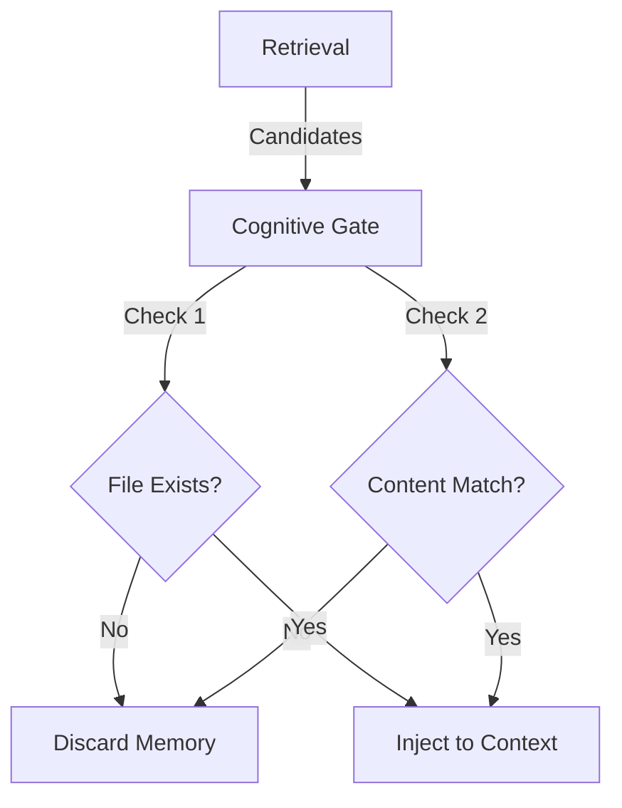

# Memory Governance & Safety

## 개요

지능형 메모리 시스템이 "잘못된 확신"이나 "무한 루프"를 유발하지 않도록 안전장치를 정의합니다.
`Auto-Claude`의 **Circular Fix Detection**과 `memU`의 **Provenance(출처 증명)** 원칙을 통합합니다.

---

## 1. Circular Fix Detection (Anti-Death-Loop)

**문제:** 에이전트가 에러를 고쳤다고 생각하지만, 실제로는 계속 같은 에러가 반복되거나(A->B->A), 미묘하게 다른 에러로 변하며 무한 루프에 빠지는 현상.

**해결:** 에러 메시지와 해결 시도를 해싱(Hashing)하여 추적합니다. (`Auto-Claude` 방식)

### 1.1 Detection Logic

```typescript
// libs/orchestrator/safety/circular.ts

class CircularFixDetector {
  private errorHistory: Map<string, number> = new Map();
  private readonly THRESHOLD = 3;

  /**
   * 에러의 "의미적 지문"을 생성합니다.
   * 스택 트레이스의 라인 번호 등 사소한 차이는 무시합니다.
   */
  private hashError(error: string): string {
    const coreError = this.extractCoreError(error); // 정규식으로 핵심만 추출
    return crypto.createHash('sha256').update(coreError).digest('hex');
  }

  check(errorMsg: string): Action {
    const hash = this.hashError(errorMsg);
    const count = (this.errorHistory.get(hash) || 0) + 1;
    this.errorHistory.set(hash, count);

    if (count >= this.THRESHOLD) {
      return {
        type: 'BLOCK',
        reason: `Circular fix detected: Same error occurred ${count} times. Stop and ask human.`,
        details: { errorHash: hash, count }
      };
    }
    
    return { type: 'ALLOW' };
  }
}
```

### 1.2 Integration

*   **Trigger:** 테스트 실패(`Verify Phase`) 시점에 즉시 호출.
*   **Response:** `BLOCK` 신호가 오면, 에이전트에게 "멈춰! 같은 방법으로는 해결 안 돼. 다른 전략을 찾거나 사람에게 물어봐"라는 **강제 시스템 프롬프트**를 주입합니다.

---

## 2. Provenance (Trust Architecture)

**원칙:** "출처가 없는 지식은 가설(Hypothesis)일 뿐이다."
`published` 상태(믿을 수 있는 지식)로 승격되려면 반드시 근거(Citation)가 있어야 합니다. (`memU` 방식)

### 2.1 Schema Enforcement

```typescript
interface MemoryUnit {
  id: string;
  content: string;
  
  // Governance Fields
  status: 'hypothesis' | 'verified' | 'published';
  confidence: number; // 0.0 ~ 1.0
  
  // 🔥 Provenance: 반드시 하나 이상 있어야 함 (published 승격 조건)
  citations: Citation[];
}

type Citation = 
  | { type: 'commit', hash: string, repo: string }   // 코드로 증명됨
  | { type: 'log', id: string, timestamp: Date }     // 실행 로그에 있음
  | { type: 'human', userId: string }                // 사람이 컨펌함
  | { type: 'test', name: string, outcome: 'pass' }  // 테스트 통과함
```

### 2.2 Verification Gate

메모리 승격 파이프라인(`Consolidation`)에서 다음 규칙을 적용합니다.

1.  **Rule 1:** `citations` 배열이 비어있으면 `status`는 영원히 `hypothesis`.
2.  **Rule 2:** `test` 또는 `human` 타입의 citation이 있어야만 `verified`로 승격 가능.
3.  **Rule 3:** `verified` 상태에서 재사용 횟수가 3회 이상이면 `published`(Global Skill)로 승격.

---

## 3. Cognitive Gate (Anti-Hallucination)

검색된 메모리를 에이전트에게 주기 전에 검증합니다.



*   **Logic:** 기억 속에 있는 "로그인 함수(`auth.ts:login`)"가 현재 파일 시스템에 실제로 존재하는지, 시그니처가 일치하는지 가볍게 확인합니다.
*   **Result:** 존재하지 않는 파일이나 함수에 대한 기억은 **"낡은 기억(Stale Memory)"** 으로 간주하여 컨텍스트에 포함시키지 않고, 백그라운드에서 `archived` 처리합니다.