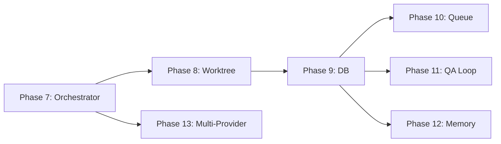

# Phase 7-13 구현 명세

> 📌 Part of [PRIORITIES.md](../PRIORITIES.md)  
> Reference Repos: [1code](../..), [Auto-Claude](../..), [emdash](../..)

---

## 상세 문서

| Phase | 문서                                                     | 설명                                   |
| ----- | -------------------------------------------------------- | -------------------------------------- |
| 7     | [📄 Agent Orchestrator](./phases/phase7-orchestrator.md) | CLI 에이전트 실행 및 스트리밍          |
| 8     | [📄 Worktree Manager](./phases/phase8-worktree.md)       | Git Worktree 격리 환경                 |
| 9     | [📄 Persistence (DB)](./phases/phase9-persistence.md)    | Drizzle ORM + SQLite                   |
| 10-13 | [📄 Advanced Features](./phases/phase10-13-advanced.md)  | Queue, QA Loop, Memory, Multi-Provider |

---

## Phase 간 의존성

---

## Phase별 요약

### Phase 7: Agent Orchestrator

**목표**: CLI 에이전트 실행 및 실시간 스트리밍

- `child_process.spawn`으로 Provider CLI 실행
- SSE로 stdout/stderr 스트리밍
- 완료 신호(`<promise>COMPLETE</promise>`) 감지

### Phase 8: Worktree Manager

**목표**: 태스크별 Git Worktree 격리

- `git worktree add/remove` 자동화
- 환경 파일 보존 (`.env`, `.npmrc`)
- 안전 장치: 메인 프로젝트 삭제 방지

### Phase 9: Persistence (DB)

**목표**: Drizzle ORM + SQLite 영속화

- tasks, stories, sessions, iterations 테이블
- 앱 시작 시 auto-migrate
- 파일 ↔ DB 동기화

### Phase 10: Queue Manager

**목표**: 병렬 태스크 스케줄링

- 최대 동시 실행 수 제한 (기본: 3)
- 우선순위 기반 스케줄링

### Phase 11: QA Loop

**목표**: 자동 테스트 및 수정 루프

- QA Reviewer → QA Fixer → 재검증 (최대 3회)
- Playwright E2E 테스트 통합

### Phase 12: Memory Graph

**목표**: Graphiti 스타일 메모리

- 벡터 임베딩 기반 시맨틱 검색
- 세션 인사이트 자동 추출

### Phase 13: Multi-Provider

**목표**: 20+ CLI 에이전트 지원

- `ProviderDefinition` 타입으로 표준화
- 설치 상태 자동 감지
