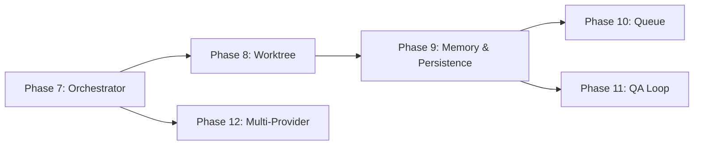

# Phase 7-13 구현 명세

> 📌 Part of [PRIORITIES.md](../PRIORITIES.md)  
> Reference Repos: [1code](../..), [Auto-Claude](../..), [emdash](../..)

---

## 상세 문서

| Phase | 문서                                                     | 설명                               |
| ----- | -------------------------------------------------------- | ---------------------------------- |
| 7     | [📄 Agent Orchestrator](./phases/phase7-orchestrator.md) | CLI 에이전트 실행 및 스트리밍      |
| 8     | [📄 Worktree Manager](./phases/phase8-worktree.md)       | Git Worktree 격리 환경             |
| 9     | [📄 Memory & Persistence](./memory/)                     | 지능형 메모리 + DB (9개 세부 문서) |
| 10    | Phase 10: Queue Manager                                  | 병렬 태스크 스케줄링               |
| 11    | Phase 11: QA Loop                                        | 자동 테스트 및 수정 루프           |
| 12    | Phase 12: Multi-Provider                                 | 20+ CLI 에이전트 지원              |

---

## Phase 간 의존성

---

## Phase별 요약

### Phase 7: Agent Orchestrator

**목표**: CLI 에이전트 실행 및 실시간 스트리밍

- `child_process.spawn`으로 Provider CLI 실행
- SSE로 stdout/stderr 스트리밍
- 완료 신호(`<promise>COMPLETE</promise>`) 감지

### Phase 8: Worktree Manager

**목표**: 태스크별 Git Worktree 격리

- `git worktree add/remove` 자동화
- 환경 파일 보존 (`.env`, `.npmrc`)
- 안전 장치: 메인 프로젝트 삭제 방지

### Phase 9: Memory & Persistence (통합)

**목표**: 지능형 메모리 시스템 + DB 영속화

**세부 단계**:
| 단계 | 문서 | 설명 |
|------|------|------|
| 9A | [Governance](./memory/04-governance.md) | 쓰기 권한, 승격, 중복 제거 |
| 9B | [Retrieval](./memory/03-retrieval.md) | Progressive Disclosure, Hybrid Search |
| 9C | [ECL Pipeline](./memory/05-ecl-pipeline.md) | Extract → Cognify → Load → Memify |
| 9D | [Code Indexing](./memory/06-code-indexing.md) | 코드 구조 인덱싱 |
| 9E | [Integration](./memory/07-integration.md) | Ralph Loop 통합, 세션 재개 |
| 9F | [Implementation](./memory/08-implementation.md) | 구현 로드맵 |

> 📚 **상세**: [specs/memory/](./memory/) (9개 문서)

### Phase 10: Queue Manager

**목표**: 병렬 태스크 스케줄링

- 최대 동시 실행 수 제한 (기본: 10)
- 우선순위 기반 스케줄링

### Phase 11: QA Loop

**목표**: 자동 테스트 및 수정 루프

- QA Reviewer → QA Fixer → 재검증 (최대 3회)
- Playwright E2E 테스트 통합

### Phase 12: Multi-Provider

**목표**: 20+ CLI 에이전트 지원

- `ProviderDefinition` 타입으로 표준화
- 설치 상태 자동 감지
