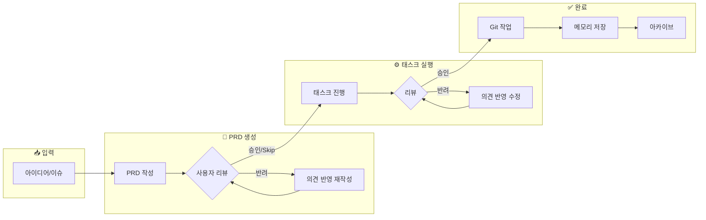

# Phase 7 설계 개선 분석 보고서

> 📌 1code, Auto-Claude, emdash, ralph 레포지토리 비교 분석

---

## 1. UI 워크플로우 정리

사용자가 정의한 워크플로우:



**현재 Phase 7 문제점**: 이 워크플로우 전체를 반영하지 못함. PRD 생성/리뷰 단계가 누락됨.

---

## 2. 레포지토리별 에이전트 관리 방식 비교

### 2.1 emdash - PTY 기반 터미널

```typescript
// node-pty 사용 (가상 터미널)
import type { IPty } from "node-pty";

const pty = require("node-pty");
proc = pty.spawn(useShell, args, {
  name: "xterm-256color",
  cols,
  rows,
  cwd: useCwd,
  env: useEnv,
});
```

**장점**:

- ✅ **실제 터미널 에뮬레이션** - 색상, 프롬프트, 인터랙티브 기능 완벽 지원
- ✅ **Provider 레지스트리 연동** - 20+ CLI 자동 감지 및 플래그 처리
- ✅ **세션 재개** - `-c -r` 등 resumeFlag 지원
- ✅ **Fallback 로직** - 실패 시 기본 쉘로 폴백

**단점**:

- ❌ Native 모듈 필요 (빌드 복잡성)
- ❌ 플랫폼별 호환성 이슈 (Windows 특히)
- ❌ 출력 파싱이 복잡 (ANSI 코드 처리 필요)

---

### 2.2 Auto-Claude - Claude Agent SDK (Python)

```python
from claude_agent_sdk import ClaudeAgentOptions, ClaudeSDKClient

client = ClaudeSDKClient(ClaudeAgentOptions(
    model=model,
    working_directory=str(project_dir),
    settings_path=str(settings_file),
    system_prompt=base_prompt,
    max_thinking_tokens=max_thinking_tokens,
    mcp_servers=mcp_servers,
    allowed_tools=allowed_tools_list,
))
```

**장점**:

- ✅ **Claude 공식 SDK** - 안정적, OAuth 인증 내장
- ✅ **MCP 서버 통합** - Context7, Linear, Puppeteer 등 플러그인
- ✅ **보안 다층 방어** - Sandbox, Permissions, Hooks
- ✅ **Extended Thinking 지원** - 토큰 예산 설정
- ✅ **Subagent 지원** - 병렬 실행 가능
- ✅ **구조화된 출력** - JSON Schema 검증

**단점**:

- ❌ Claude 전용 (다른 Provider 지원 불가)
- ❌ Python 의존성
- ❌ SDK 업데이트에 의존

---

### 2.3 1code - tRPC + Electron

```typescript
// tRPC 라우터에서 spawn 사용
import { spawn } from "node:child_process";

// 하지만 실제 Claude 연동은 SDK 또는 CLI 호출
const proc = spawn(cli, args, { cwd, env });
```

**장점**:

- ✅ **tRPC 타입 안전성** - 프론트엔드-백엔드 타입 공유
- ✅ **세션 관리** - sessionId, streamId로 재개 가능
- ✅ **Electron IPC 통합** - 데스크톱 앱 최적화

**단점**:

- ❌ Electron 필수
- ❌ 복잡한 설정

---

### 2.4 ralph - 단순 쉘 스크립트

```bash
# 가장 단순한 방식
OUTPUT=$(cat "$SCRIPT_DIR/prompt.md" | amp --dangerously-allow-all 2>&1 | tee /dev/stderr) || true

# 완료 신호 감지
if echo "$OUTPUT" | grep -q "<promise>COMPLETE</promise>"; then
  echo "Ralph completed all tasks!"
  exit 0
fi
```

**장점**:

- ✅ **단순함** - 이해하기 쉬움
- ✅ **Provider 독립적** - amp/claude 쉽게 전환
- ✅ **안정성** - 복잡한 의존성 없음

**단점**:

- ❌ 실시간 스트리밍 없음
- ❌ 상태 관리 없음
- ❌ 에러 핸들링 제한적

---

## 3. 방식별 비교표

| 방식                | emdash (PTY)  | Auto-Claude (SDK) | 1code (tRPC) | ralph (쉘) |
| ------------------- | ------------- | ----------------- | ------------ | ---------- |
| **실시간 스트리밍** | ✅ 완벽       | ✅ 완벽           | ✅ 완벽      | ❌ 없음    |
| **색상 지원**       | ✅ 완벽       | ⚠️ 제한적         | ⚠️ 제한적    | ❌ 없음    |
| **인터랙티브**      | ✅ 완벽       | ⚠️ 제한적         | ⚠️ 제한적    | ❌ 없음    |
| **Multi-Provider**  | ✅ 20+        | ❌ Claude만       | ❌ Claude만  | ⚠️ 수동    |
| **보안**            | ⚠️ 수동       | ✅ 다층 방어      | ⚠️ 수동      | ❌ 없음    |
| **MCP 통합**        | ❌ 없음       | ✅ 완벽           | ⚠️ 제한적    | ❌ 없음    |
| **세션 재개**       | ✅ resumeFlag | ✅ SDK 내장       | ✅ sessionId | ❌ 없음    |
| **Native 의존성**   | ❌ node-pty   | ❌ Python         | ❌ Electron  | ✅ 없음    |
| **복잡도**          | 높음          | 중간              | 높음         | 낮음       |

---

## 4. Gemini CLI 특성 분석

Gemini CLI는 다른 Provider와 다른 특성을 가짐:

```typescript
// emdash registry에서 Gemini 정의
{
  id: 'gemini',
  name: 'Gemini',
  cli: 'gemini',
  installCommand: 'npm install -g @google/gemini-cli',
  autoApproveFlag: '--yolomode',
  initialPromptFlag: '-i',
  resumeFlag: '--resume',
  icon: 'gemini.png',
}
```

**Gemini 특화 기능**:

- `--yolomode`: 자동 승인 모드
- `-i`: 인터랙티브 모드 (초기 프롬프트)
- `--resume`: 세션 재개

---

## 5. Phase 7 개선 제안

### 5.1 워크플로우 반영한 상태 확장

현재 `LoopPhase` (7개) → **`WorkflowPhase`** (10개)로 확장:

```typescript
type WorkflowPhase =
  // 준비 단계
  | "idle" // 대기 중
  | "initializing" // Worktree, 환경 준비

  // PRD 생성 단계 (신규)
  | "prd_generating" // AI가 PRD 작성 중
  | "prd_reviewing" // 사용자 PRD 리뷰 대기

  // 구현 단계
  | "planning" // 다음 스토리 선택
  | "coding" // 에이전트 코딩 중
  | "verifying" // 빌드/테스트 검증

  // 리뷰 및 완료 단계
  | "task_reviewing" // 사용자 태스크 리뷰 대기
  | "completing" // Git 작업, 메모리 저장 중
  | "completed"; // 완료
```

### 5.2 하이브리드 에이전트 러너

spawn 대신 **하이브리드 방식** 제안:

```typescript
// lib/orchestrator/agent-runner.ts
interface AgentRunner {
  // Provider별 최적화된 런타임 선택
  run(session: RalphSession, options: RunOptions): Promise<void>;
}

class HybridAgentRunner implements AgentRunner {
  async run(session: RalphSession, options: RunOptions): Promise<void> {
    const provider = getProvider(session.providerId);

    switch (provider.runtime) {
      case "sdk":
        // Gemini, Claude: 공식 SDK 사용 (가능한 경우)
        return this.runWithSDK(session, options);

      case "pty":
        // 인터랙티브 필요 시: node-pty
        return this.runWithPTY(session, options);

      case "spawn":
      default:
        // 기본: child_process.spawn
        return this.runWithSpawn(session, options);
    }
  }

  private async runWithSpawn(session: RalphSession, options: RunOptions) {
    // 현재 구현
  }

  private async runWithPTY(session: RalphSession, options: RunOptions) {
    // emdash 스타일 PTY
    const pty = require("node-pty");
    const proc = pty.spawn(shell, args, { cwd, env });
    proc.onData((data) => this.emit("stdout", data));
  }

  private async runWithSDK(session: RalphSession, options: RunOptions) {
    // Gemini SDK (미래)
    // const gemini = new GeminiAgent({ ... });
    throw new Error("SDK runtime not yet implemented");
  }
}
```

### 5.3 PRD 생성기 분리

PRD 생성은 별도 모듈로 분리:

```typescript
// lib/prd/generator.ts
class PRDGenerator {
  constructor(
    private providerId: ProviderId,
    private agentRunner: AgentRunner,
  ) {}

  async generate(input: IdeaInput): Promise<PRD> {
    // 1. 아이디어 → PRD 프롬프트 생성
    const prompt = this.buildPRDPrompt(input);

    // 2. AI로 PRD 생성
    const session = await this.createSession();
    const output = await this.agentRunner.run(session, {
      prompt,
      mode: "prd", // PRD 생성 모드
    });

    // 3. PRD 파싱 및 검증
    return this.parsePRD(output);
  }

  async revise(prd: PRD, feedback: string): Promise<PRD> {
    // 반려 피드백 반영
  }
}
```

### 5.4 리뷰 시스템

사용자 리뷰 대기/처리:

```typescript
// lib/review/manager.ts
interface ReviewRequest {
  type: "prd" | "task";
  sessionId: string;
  content: unknown; // PRD 또는 Task 결과
  createdAt: Date;
}

class ReviewManager {
  async requestReview(request: ReviewRequest): Promise<void> {
    // DB에 리뷰 요청 저장
    await db.insert(reviews).values(request);

    // WebSocket으로 UI에 알림
    this.notifyUI(request);

    // 상태 전환
    this.transitionTo(
      request.type === "prd" ? "prd_reviewing" : "task_reviewing",
    );
  }

  async submitReview(
    sessionId: string,
    decision: ReviewDecision,
  ): Promise<void> {
    if (decision.approved) {
      // 다음 단계로 진행
      this.transitionTo(decision.type === "prd" ? "planning" : "completing");
    } else {
      // 피드백 반영하여 재시도
      await this.retryWithFeedback(sessionId, decision.feedback);
    }
  }
}
```

### 5.5 완료 후처리

Git 작업, 메모리 저장 등:

```typescript
// lib/completion/handler.ts
class CompletionHandler {
  async handle(session: RalphSession): Promise<void> {
    // 1. Worktree 커밋
    await this.commitChanges(session);

    // 2. 메모리 저장 (패턴, 인사이트)
    await this.saveMemory(session);

    // 3. PR 생성 (선택적)
    if (session.createPR) {
      await this.createPullRequest(session);
    }

    // 4. Worktree 정리
    await this.cleanupWorktree(session);

    // 5. 아카이브
    await this.archive(session);
  }
}
```

---

## 6. 권장 구현 순서

1. **Phase 7.1**: 기본 spawn 기반 Agent Runner (현재 설계)
2. **Phase 7.2**: PRD 생성기 + 리뷰 시스템 추가
3. **Phase 7.3**: 완료 후처리 Handler 구현
4. **Phase 7.4**: (선택) PTY 지원 추가 (인터랙티브 필요 시)
5. **Phase 7.5**: (선택) SDK 런타임 추가 (Gemini SDK 출시 시)

---

## 7. 결론

| 항목            | 현재 설계  | 개선 방향                           |
| --------------- | ---------- | ----------------------------------- |
| 상태 머신       | 7개 Phase  | 10개 Phase (PRD, 리뷰 추가)         |
| 에이전트 런타임 | spawn only | 하이브리드 (spawn + PTY + SDK)      |
| PRD 생성        | 없음       | PRDGenerator 분리                   |
| 리뷰 시스템     | 없음       | ReviewManager 추가                  |
| 완료 처리       | 부족       | CompletionHandler 추가              |
| Gemini 지원     | 기본       | `-i`, `--yolomode`, `--resume` 활용 |

**spawn이 최선인가?**

- ✅ Next.js 환경에서는 **spawn이 현실적인 선택**
- ✅ PTY는 Native 모듈 필요, Next.js와 호환성 이슈
- ⚠️ 미래에 Gemini SDK 출시되면 SDK 런타임으로 전환 고려
