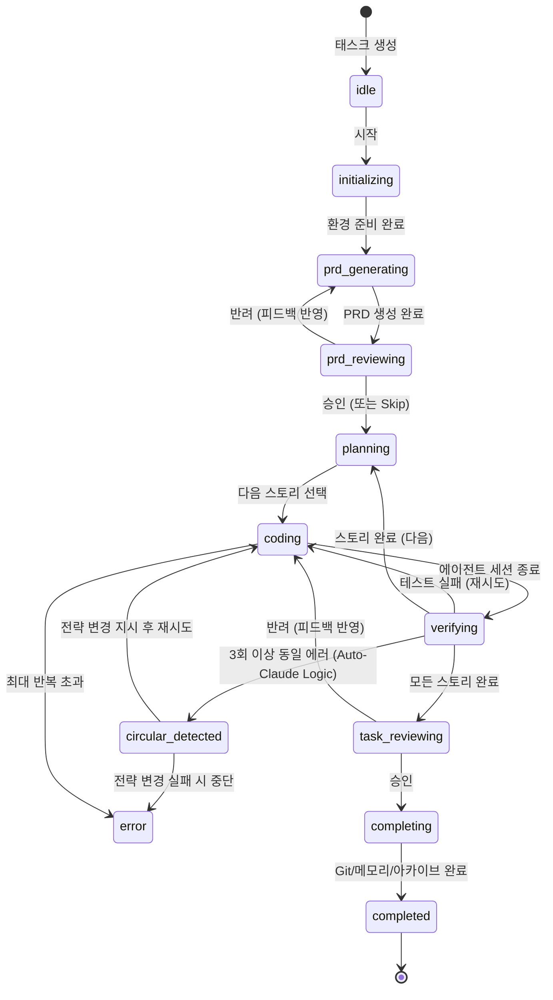

# Phase 7: Agent Orchestrator

> 📌 Part of [Phase 7-13 구현 명세](../phases.md)  
> 관련 스토리: US-003, US-004, US-007, US-010  
> 참조: [phase7-analysis.md](./phase7-analysis.md)  
> 💡 **Tip**: 1code v0.0.33 Plan Mode 안정성 패치 참고 (claude abort issue fix)

CLI 에이전트(Gemini 우선)를 통한 Ralph Loop 실행 및 실시간 스트리밍

---

## 핵심 설계 원칙

1. **시스템 제어는 직접 수행** - PRD 생성, 태스크 관리, 메모리 저장 등 시스템적 요소는 AI에게 맡기지 않고 코드로 직접 제어
2. **AI는 코딩에만 집중** - 에이전트는 순수하게 코드 작성/수정만 담당
3. **ralph.sh 철학** - 단순하고 예측 가능한 루프 구조 유지
4. **node-pty 기반** - 실제 터미널 에뮬레이션으로 모든 CLI 에이전트 지원
5. **안전장치 (Safety Nets)** - 순환 수정 감지 및 터미널 스냅샷을 통한 폭주 방지

---

## 워크플로우 상태 머신



---

## 디렉토리 구조

```
lib/
└── orchestrator/
    ├── index.ts                # 메인 export
    ├── types.ts                # 타입 정의
    ├── ralph-loop.ts           # Ralph Loop 메인 루프
    ├── pty-runner.ts           # node-pty 기반 에이전트 실행
    ├── stream-emitter.ts       # SSE 스트리밍
    ├── signal-detector.ts      # 완료/에러 신호 감지
    └── safety/                 # 안전장치
        └── circular-detector.ts # 순환 수정 감지 (Auto-Claude)

└── prd/
    ├── generator.ts            # PRD 생성
    └── parser.ts               # PRD 파싱/검증

└── review/
    ├── manager.ts              # 리뷰 요청/처리
    └── types.ts                # ReviewRequest

└── completion/
    ├── handler.ts              # 완료 후처리
    ├── git-ops.ts              # Git 커밋/PR
    └── memory-ops.ts           # agentdb 저장
```

---

## 주요 모듈 상세

### 1. Safety: Circular Fix Detector (from Auto-Claude)

에이전트가 동일한 에러를 반복해서 수정하려고 시도하는 "Death Loop"를 감지합니다.

```typescript
// lib/orchestrator/safety/circular-detector.ts

export class CircularFixDetector {
  private errorHistory: Map<string, number> = new Map(); // hash -> count
  private readonly THRESHOLD = 3;

  /**
   * 에러 해시 생성 (Error Msg + Stack Trace 일부)
   */
  private hashError(errorOutput: string): string {
    return crypto.createHash('sha256').update(errorOutput.slice(0, 500)).digest('hex');
  }

  /**
   * 순환 감지 체크
   */
  check(errorOutput: string): { detected: boolean; count: number } {
    const hash = this.hashError(errorOutput);
    const count = (this.errorHistory.get(hash) || 0) + 1;
    this.errorHistory.set(hash, count);

    return {
      detected: count >= this.THRESHOLD,
      count
    };
  }

  reset() {
    this.errorHistory.clear();
  }
}
```

### 2. Ralph Loop: Verifying & Safety Check

```typescript
// lib/orchestrator/ralph-loop.ts

async function runVerification() {
  const result = await runTests();
  
  if (!result.passed) {
    // 순환 수정 감지
    const safety = this.circularDetector.check(result.errorOutput);
    
    if (safety.detected) {
      // 전략: Gotcha 주입 및 전략 변경 프롬프트
      await this.injectGotchaAndPivot(result.errorOutput);
      // 루프 계속 진행 (단, 프롬프트가 변경됨)
      return false;
    }
    
    // 일반 실패: 터미널 스냅샷 저장 (agentdb)
    await this.memoryOps.saveTerminalSnapshot(this.session.id, result);
  }
  
  return result.passed;
}
```

### 3. Memory Operations (agentdb Integration)

시스템이 직접 제어하는 메모리 저장 로직입니다. `pglite`가 아닌 `agentdb`를 사용합니다.

```typescript
// lib/completion/memory-ops.ts
import { RalphMemoryService } from '@/libs/memory';
// ... (existing code)
```

### 4. Stability & Graceful Shutdown (Inspired by 1code v0.0.33)

사용자가 모드를 전환하거나(Plan -> Code), 프로세스를 강제 종료할 때 좀비 프로세스가 남거나 에이전트가 오동작하는 것을 방지합니다.

#### AbortController Pattern

모든 장기 실행(Long-running) 작업은 `AbortSignal`을 받아야 합니다.

```typescript
// lib/orchestrator/pty-runner.ts

export class PtyRunner {
  private ptyProcess: IPty | null = null;
  private currentAbortController: AbortController | null = null;

  /**
   * 안전하게 에이전트 실행
   */
  async runAgent(cmd: string, args: string[], signal: AbortSignal): Promise<void> {
    return new Promise((resolve, reject) => {
      // 1. 시그널 발생 시 즉시 정리 로직
      const onAbort = () => {
        this.killProcess();
        reject(new Error('Aborted by user'));
      };

      if (signal.aborted) return onAbort();
      signal.addEventListener('abort', onAbort);

      // 2. 프로세스 시작
      this.ptyProcess = spawn(cmd, args, { ... });

      this.ptyProcess.onExit((code) => {
        signal.removeEventListener('abort', onAbort);
        if (code.exitCode === 0) resolve();
        else reject(new Error(`Exit code: ${code.exitCode}`));
      });
    });
  }

  /**
   * 안전한 프로세스 종료 (SIGTERM -> SIGKILL)
   */
  private killProcess() {
    if (this.ptyProcess) {
      // Graceful shutdown attempt
      this.ptyProcess.kill('SIGTERM'); 
      
      // Force kill if needed (setTimeout)
      setTimeout(() => {
        if (this.ptyProcess) this.ptyProcess.kill('SIGKILL');
      }, 5000);
    }
  }
}
```

#### State Recovery

프로세스가 비정상 종료되더라도, 마지막 상태(Last Known Good State)를 파일(`state.json`)에 기록하여 재시작 시 복구할 수 있어야 합니다.

#### Orphan Process Prevention (from emdash #679)

앱 종료 시 실행 중인 CLI 에이전트들이 좀비 프로세스(Orphan)로 남지 않도록 해야 합니다. 단순 `kill()`은 자식의 자식 프로세스까지 정리하지 못할 수 있으므로, 프로세스 그룹 ID(PGID)를 이용하거나 `tree-kill` 라이브러리 패턴을 사용하여 프로세스 트리 전체를 정리합니다.

```typescript
// 예시: PGID를 이용한 그룹 킬 (Linux/macOS)
if (process.pid) {
  try {
    process.kill(-process.pid, 'SIGKILL'); // 음수 PID는 프로세스 그룹을 의미
  } catch (e) {
    // ...
  }
}
```

---

## 시스템 vs AI 역할 분담 요약

| 영역               | 담당             | 설명                          |
| ------------------ | ---------------- | ----------------------------- |
| **Worktree 관리**  | 시스템           | Git worktree add/remove       |
| **PRD 생성**       | 시스템 (AI 옵션) | 아이디어 → 구조화된 PRD       |
| **스토리 선택**    | 시스템           | prd.json에서 다음 스토리 결정 |
| **순환 감지**      | **시스템**       | Error Hash 3회 반복 체크      |
| **코딩**           | **AI**           | 실제 코드 작성/수정           |
| **빌드/테스트**    | 시스템           | npm test, npm run build       |
| **메모리 저장**    | 시스템           | **agentdb**에 패턴/스냅샷 저장|
| **아카이브**       | 시스템           | 완료된 태스크 보관            |