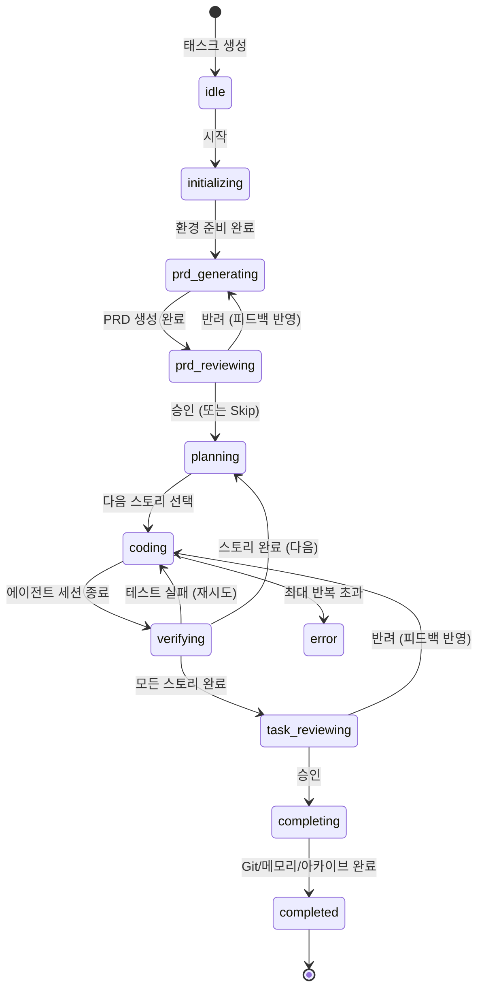

# Phase 7: Agent Orchestrator

> 📌 Part of [Phase 7-13 구현 명세](../phases.md)  
> 관련 스토리: US-003, US-004, US-007, US-010  
> 참조: [phase7-analysis.md](./phase7-analysis.md)

CLI 에이전트(Gemini 우선)를 통한 Ralph Loop 실행 및 실시간 스트리밍

---

## 핵심 설계 원칙

1. **시스템 제어는 직접 수행** - PRD 생성, 태스크 관리, 메모리 저장 등 시스템적 요소는 AI에게 맡기지 않고 코드로 직접 제어
2. **AI는 코딩에만 집중** - 에이전트는 순수하게 코드 작성/수정만 담당
3. **ralph.sh 철학** - 단순하고 예측 가능한 루프 구조 유지
4. **node-pty 기반** - 실제 터미널 에뮬레이션으로 모든 CLI 에이전트 지원

---

## 워크플로우 상태 머신



---

## 디렉토리 구조

```
lib/
└── orchestrator/
    ├── index.ts                # 메인 export
    ├── types.ts                # 타입 정의
    ├── ralph-loop.ts           # Ralph Loop 메인 루프
    ├── pty-runner.ts           # node-pty 기반 에이전트 실행
    ├── stream-emitter.ts       # SSE 스트리밍
    └── signal-detector.ts      # 완료/에러 신호 감지

└── prd/
    ├── generator.ts            # PRD 생성 (시스템 제어)
    ├── parser.ts               # PRD 파싱/검증
    └── templates/              # PRD 템플릿

└── review/
    ├── manager.ts              # 리뷰 요청/처리
    └── types.ts                # ReviewRequest, ReviewDecision

└── completion/
    ├── handler.ts              # 완료 후처리
    ├── git-ops.ts              # Git 커밋/PR
    ├── memory-ops.ts           # 메모리 저장
    └── archive-ops.ts          # 아카이브

app/api/orchestrator/
├── start/route.ts              # POST: Ralph Loop 시작
├── stream/route.ts             # GET: SSE 스트림 연결
├── stop/route.ts               # POST: Ralph Loop 중지
├── status/route.ts             # GET: 현재 상태 조회
└── review/route.ts             # POST: 리뷰 제출 (승인/반려)
```

---

## 타입 정의

### 워크플로우 상태 (확장)

```typescript
// lib/orchestrator/types.ts

/** 워크플로우 상태 (10단계) */
type WorkflowPhase =
  // 준비
  | "idle" // 대기 중
  | "initializing" // Worktree, 환경 준비

  // PRD 생성 (시스템이 직접 제어)
  | "prd_generating" // PRD 작성 중
  | "prd_reviewing" // 사용자 리뷰 대기

  // 구현 (에이전트가 코딩)
  | "planning" // 다음 스토리 선택 (시스템)
  | "coding" // 에이전트 코딩 중
  | "verifying" // 빌드/테스트 검증 (시스템)

  // 리뷰 및 완료
  | "task_reviewing" // 사용자 태스크 리뷰 대기
  | "completing" // Git/메모리/아카이브 (시스템)
  | "completed"; // 완료

/** 시스템 vs AI 담당 영역 */
const SYSTEM_CONTROLLED: WorkflowPhase[] = [
  "initializing", // Worktree 생성
  "prd_generating", // PRD 생성 로직
  "planning", // 스토리 선택 로직
  "verifying", // 빌드/테스트 실행
  "completing", // Git/메모리 처리
];

const AI_CONTROLLED: WorkflowPhase[] = [
  "coding", // 에이전트가 코딩
];

const USER_CONTROLLED: WorkflowPhase[] = [
  "prd_reviewing", // PRD 승인/반려
  "task_reviewing", // 태스크 승인/반려
];
```

### Ralph 세션

```typescript
/** Ralph 세션 */
interface RalphSession {
  id: string;
  taskId: string;
  providerId: ProviderId;

  // 워크플로우 상태
  phase: WorkflowPhase;
  currentIteration: number;
  maxIterations: number; // 기본: 10

  // 현재 작업
  currentStoryId?: string;

  // PTY 프로세스
  ptyId?: string; // node-pty 세션 ID

  // 경로
  worktreePath: string;
  metadataPath: string; // .ralph/tasks/{taskId}/

  // 타임스탬프
  startedAt: Date;
  lastActivityAt: Date;

  // 히스토리
  iterations: Iteration[];
}
```

---

## node-pty 기반 에이전트 러너

```typescript
// lib/orchestrator/pty-runner.ts
import type { IPty } from "node-pty";
import { getProvider, GEMINI_PROVIDER } from "../providers";

interface PTYSession {
  id: string;
  pty: IPty;
  output: string[];
}

const sessions = new Map<string, PTYSession>();

export class PTYRunner {
  private pty: typeof import("node-pty");

  constructor() {
    // Lazy load to avoid startup issues
    this.pty = require("node-pty");
  }

  /**
   * 에이전트 시작 (emdash 패턴)
   *
   * ralph.sh 철학: 단순하게 CLI 실행하고 출력 감시
   */
  async spawn(options: {
    sessionId: string;
    providerId: ProviderId;
    cwd: string;
    prompt: string;
    autoApprove?: boolean;
    onData: (data: string) => void;
    onExit: (code: number) => void;
  }): Promise<void> {
    const provider = getProvider(options.providerId) ?? GEMINI_PROVIDER;

    // 쉘 명령 구성 (emdash 스타일)
    const shell = process.env.SHELL || "/bin/bash";
    const command = this.buildCommand(provider, options);

    const proc = this.pty.spawn(shell, ["-c", command], {
      name: "xterm-256color",
      cols: 120,
      rows: 40,
      cwd: options.cwd,
      env: {
        TERM: "xterm-256color",
        COLORTERM: "truecolor",
        HOME: process.env.HOME!,
        USER: process.env.USER!,
        SHELL: shell,
        // Provider 환경 변수
        GEMINI_API_KEY: process.env.GEMINI_API_KEY,
        ANTHROPIC_API_KEY: process.env.ANTHROPIC_API_KEY,
      },
    });

    const session: PTYSession = {
      id: options.sessionId,
      pty: proc,
      output: [],
    };
    sessions.set(options.sessionId, session);

    // 출력 감시
    proc.onData((data) => {
      session.output.push(data);
      options.onData(data);
    });

    proc.onExit(({ exitCode }) => {
      sessions.delete(options.sessionId);
      options.onExit(exitCode);
    });
  }

  /**
   * CLI 명령 구성 (Provider별 플래그)
   */
  private buildCommand(
    provider: ProviderDefinition,
    options: {
      prompt: string;
      autoApprove?: boolean;
    },
  ): string {
    const args: string[] = [provider.cli];

    // Auto-approve (Gemini: --yolomode)
    if (options.autoApprove && provider.autoApproveFlag) {
      args.push(provider.autoApproveFlag);
    }

    // Initial prompt (Gemini: -i)
    if (provider.initialPromptFlag && options.prompt) {
      args.push(provider.initialPromptFlag);
      // 프롬프트는 stdin으로 전달하거나 임시 파일로
    }

    return args.join(" ");
  }

  /**
   * 프롬프트 전송 (PTY stdin)
   */
  write(sessionId: string, data: string): void {
    const session = sessions.get(sessionId);
    if (session) {
      session.pty.write(data);
    }
  }

  /**
   * 세션 종료
   */
  kill(sessionId: string): void {
    const session = sessions.get(sessionId);
    if (session) {
      session.pty.kill();
      sessions.delete(sessionId);
    }
  }

  /**
   * 출력에서 완료 신호 감지 (ralph.sh 스타일)
   */
  detectSignal(output: string): "COMPLETE" | "ERROR" | null {
    if (output.includes("<promise>COMPLETE</promise>")) {
      return "COMPLETE";
    }
    if (output.includes("Error:") || output.includes("FATAL")) {
      return "ERROR";
    }
    return null;
  }
}
```

---

## Ralph Loop 메인 루프 (시스템 제어)

```typescript
// lib/orchestrator/ralph-loop.ts
import { PTYRunner } from "./pty-runner";
import { PRDGenerator } from "../prd/generator";
import { ReviewManager } from "../review/manager";
import { CompletionHandler } from "../completion/handler";

/**
 * Ralph Loop 메인 클래스
 *
 * 핵심 원칙:
 * - 시스템이 전체 흐름 제어
 * - AI는 coding phase에서만 동작
 * - ralph.sh처럼 단순하고 예측 가능한 루프
 */
export class RalphLoop {
  private session: RalphSession;
  private ptyRunner: PTYRunner;
  private prdGenerator: PRDGenerator;
  private reviewManager: ReviewManager;
  private completionHandler: CompletionHandler;

  async run(taskId: string): Promise<void> {
    // === Phase: initializing ===
    this.transition("initializing");
    await this.initialize(taskId);

    // === Phase: prd_generating (시스템 제어) ===
    this.transition("prd_generating");
    const prd = await this.prdGenerator.generate({
      taskId,
      ideaDescription: this.session.ideaDescription,
    });

    // === Phase: prd_reviewing (사용자 제어) ===
    this.transition("prd_reviewing");
    const prdDecision = await this.reviewManager.waitForReview({
      type: "prd",
      sessionId: this.session.id,
      content: prd,
    });

    if (!prdDecision.approved) {
      // 반려 시 피드백 반영하여 재생성
      await this.prdGenerator.revise(prd, prdDecision.feedback);
      // prd_reviewing으로 돌아감 (루프)
    }

    // === Main Loop (ralph.sh 스타일) ===
    while (this.session.currentIteration < this.session.maxIterations) {
      // --- Phase: planning (시스템 제어) ---
      this.transition("planning");
      const story = await this.selectNextStory();

      if (!story) {
        // 모든 스토리 완료 → 리뷰
        break;
      }

      // --- Phase: coding (AI 제어) ---
      this.transition("coding");
      await this.runAgentSession(story);

      // --- Phase: verifying (시스템 제어) ---
      this.transition("verifying");
      const passed = await this.runVerification();

      if (passed) {
        await this.markStoryComplete(story.id);
      }
      // 실패해도 다음 iteration에서 같은 스토리 재시도

      this.session.currentIteration++;
    }

    // === Phase: task_reviewing (사용자 제어) ===
    this.transition("task_reviewing");
    const taskDecision = await this.reviewManager.waitForReview({
      type: "task",
      sessionId: this.session.id,
      content: await this.getTaskSummary(),
    });

    if (!taskDecision.approved) {
      // 반려 시 피드백 반영하여 추가 구현
      await this.handleTaskFeedback(taskDecision.feedback);
      // coding으로 돌아감
    }

    // === Phase: completing (시스템 제어) ===
    this.transition("completing");
    await this.completionHandler.handle(this.session);

    // === Phase: completed ===
    this.transition("completed");
  }

  /**
   * 에이전트 세션 실행 (ralph.sh 스타일)
   *
   * 시스템이 프롬프트 생성 → 에이전트 실행 → 신호 감지
   */
  private async runAgentSession(story: Story): Promise<void> {
    // 1. 프롬프트 생성 (시스템이 직접)
    const prompt = this.buildPrompt(story);

    // 2. PTY로 에이전트 실행
    return new Promise((resolve, reject) => {
      this.ptyRunner.spawn({
        sessionId: this.session.id,
        providerId: this.session.providerId,
        cwd: this.session.worktreePath,
        prompt,
        autoApprove: true,
        onData: (data) => {
          // 스트리밍 출력
          this.emitter.emit({ type: "stdout", data });

          // 완료 신호 감지
          const signal = this.ptyRunner.detectSignal(data);
          if (signal === "COMPLETE") {
            this.ptyRunner.kill(this.session.id);
            resolve();
          }
        },
        onExit: (code) => {
          if (code === 0) resolve();
          else reject(new Error(`Agent exited with code ${code}`));
        },
      });

      // 프롬프트 stdin으로 전달
      this.ptyRunner.write(this.session.id, prompt + "\n");
    });
  }

  /**
   * 프롬프트 생성 (시스템이 직접 제어)
   *
   * ralph.sh처럼 prd.json, progress.txt 기반
   */
  private buildPrompt(story: Story): string {
    const prd = this.loadPRD();
    const progress = this.loadProgress();
    const patterns = this.loadPatterns();

    return `
# Current Story: ${story.id}
${story.title}

## Description
${story.description}

## Acceptance Criteria
${story.acceptanceCriteria.map((c) => `- [ ] ${c}`).join("\n")}

---

# Context

## Project
${prd.project}: ${prd.description}

## Previous Progress
${progress}

## Codebase Patterns
${patterns}

---

# Instructions

1. Implement the story above
2. Run tests to verify: \`npm test\`
3. When ALL acceptance criteria pass, output: <promise>COMPLETE</promise>
4. If tests fail, fix and retry
`.trim();
  }
}
```

---

## PRD 생성기 (시스템 제어)

```typescript
// lib/prd/generator.ts

/**
 * PRD 생성기
 *
 * AI에게 맡기지 않고 시스템이 직접 생성
 * 사용자 입력을 구조화된 PRD로 변환
 */
export class PRDGenerator {
  /**
   * 아이디어 → PRD 생성
   *
   * 방식 1: 템플릿 기반 (AI 없이)
   * 방식 2: AI 호출하여 생성 (옵션)
   */
  async generate(input: {
    taskId: string;
    ideaDescription: string;
    useAI?: boolean;
  }): Promise<PRD> {
    if (input.useAI) {
      return this.generateWithAI(input);
    }
    return this.generateFromTemplate(input);
  }

  /**
   * 템플릿 기반 PRD 생성 (AI 없이)
   */
  private generateFromTemplate(input: {
    taskId: string;
    ideaDescription: string;
  }): PRD {
    return {
      id: input.taskId,
      branchName: `ralph/${this.slugify(input.ideaDescription.slice(0, 30))}`,
      project: "ralph-web",
      description: input.ideaDescription,
      stories: [
        {
          id: "US-001",
          title: "Initial Implementation",
          description: input.ideaDescription,
          acceptanceCriteria: [
            "기능이 정상 동작해야 함",
            "테스트가 통과해야 함",
            "빌드가 성공해야 함",
          ],
          priority: 1,
          passes: false,
        },
      ],
      createdAt: new Date().toISOString(),
    };
  }

  /**
   * AI로 PRD 생성 (옵션)
   */
  private async generateWithAI(input: {
    taskId: string;
    ideaDescription: string;
  }): Promise<PRD> {
    // 별도 에이전트 세션으로 PRD 생성
    // Auto-Claude의 Spec Creation Pipeline 참고
  }

  /**
   * 피드백 반영하여 PRD 수정
   */
  async revise(prd: PRD, feedback: string): Promise<PRD> {
    // 피드백 기반 수정
    return {
      ...prd,
      description: `${prd.description}\n\n## Additional Feedback\n${feedback}`,
    };
  }
}
```

---

## 리뷰 매니저 (사용자 제어)

```typescript
// lib/review/manager.ts

interface ReviewRequest {
  type: "prd" | "task";
  sessionId: string;
  content: unknown;
  createdAt: Date;
}

interface ReviewDecision {
  approved: boolean;
  feedback?: string;
  decidedAt: Date;
}

/**
 * 리뷰 매니저
 *
 * 사용자 승인/반려 처리
 */
export class ReviewManager {
  /**
   * 리뷰 요청 생성 및 대기
   *
   * 설정에 따라 Skip 가능
   */
  async waitForReview(request: ReviewRequest): Promise<ReviewDecision> {
    const settings = await this.getSettings(request.sessionId);

    // Auto-approve 설정 시 바로 승인
    if (settings.autoApprovePRD && request.type === "prd") {
      return { approved: true, decidedAt: new Date() };
    }
    if (settings.autoApproveTask && request.type === "task") {
      return { approved: true, decidedAt: new Date() };
    }

    // DB에 리뷰 요청 저장
    await db.insert(reviews).values({
      ...request,
      status: "pending",
    });

    // WebSocket으로 UI에 알림
    this.emitter.emit({
      type: "review_requested",
      data: request,
    });

    // 사용자 응답 대기 (API 호출될 때까지)
    return this.waitForDecision(request.sessionId, request.type);
  }

  /**
   * 리뷰 제출 (API에서 호출)
   */
  async submitReview(
    sessionId: string,
    type: "prd" | "task",
    decision: { approved: boolean; feedback?: string },
  ): Promise<void> {
    await db
      .update(reviews)
      .set({
        status: decision.approved ? "approved" : "rejected",
        feedback: decision.feedback,
        decidedAt: new Date(),
      })
      .where(and(eq(reviews.sessionId, sessionId), eq(reviews.type, type)));

    // 대기 중인 Promise 해결
    this.resolveWaiting(sessionId, type, decision);
  }
}
```

---

## 완료 핸들러 (시스템 제어)

```typescript
// lib/completion/handler.ts

/**
 * 완료 후처리 핸들러
 *
 * AI 없이 시스템이 직접 처리
 */
export class CompletionHandler {
  async handle(session: RalphSession): Promise<void> {
    // 1. Git 커밋 (시스템 제어)
    await this.gitOps.commitAll(session.worktreePath, {
      message: `feat(${session.taskId}): complete all stories`,
    });

    // 2. 메모리 저장 (시스템 제어)
    await this.memoryOps.extractAndSave(session);

    // 3. PR 생성 (선택적)
    if (session.createPR) {
      await this.gitOps.createPullRequest(session);
    }

    // 4. 아카이브 (ralph.sh 스타일)
    await this.archiveOps.archive(session);

    // 5. Worktree 정리
    await this.worktreeManager.remove(session.taskId);
  }
}
```

---

## 메모리 관리 (시스템 제어)

```typescript
// lib/completion/memory-ops.ts

/**
 * 메모리 저장 (시스템이 직접 관리)
 *
 * ralph.sh의 progress.txt 패턴 + 글로벌 패턴 승격
 */
export class MemoryOps {
  /**
   * 세션에서 패턴/인사이트 추출 및 저장
   */
  async extractAndSave(session: RalphSession): Promise<void> {
    // 1. progress.txt에서 패턴 추출
    const progressPath = path.join(session.metadataPath, "progress.txt");
    const progress = await fs.readFile(progressPath, "utf-8");

    const patterns = this.extractPatterns(progress);

    // 2. 태스크별 메모리에 저장
    await db.insert(taskPatterns).values(
      patterns.map((p) => ({
        taskId: session.taskId,
        pattern: p.content,
        category: p.category,
        createdAt: new Date(),
      })),
    );

    // 3. 글로벌 패턴 승격 (2회 이상 등장 시)
    await this.promoteToGlobal(patterns);
  }

  /**
   * progress.txt에서 패턴 추출
   *
   * 형식:
   * ## Codebase Patterns
   * - [convention] 컴포넌트는 components/ 디렉토리에
   * - [gotcha] useEffect에서 cleanup 필수
   */
  private extractPatterns(progress: string): Pattern[] {
    const patterns: Pattern[] = [];
    const regex = /- \[(convention|gotcha|tip)\] (.+)/g;

    let match;
    while ((match = regex.exec(progress)) !== null) {
      patterns.push({
        category: match[1] as "convention" | "gotcha" | "tip",
        content: match[2],
      });
    }

    return patterns;
  }

  /**
   * 글로벌 패턴으로 승격
   */
  private async promoteToGlobal(patterns: Pattern[]): Promise<void> {
    for (const pattern of patterns) {
      // 동일 패턴이 2회 이상 등장하면 글로벌로 승격
      const count = await db
        .select({ count: sql`count(*)` })
        .from(taskPatterns)
        .where(like(taskPatterns.pattern, `%${pattern.content}%`));

      if (count[0].count >= 2) {
        await db
          .insert(globalPatterns)
          .values({
            pattern: pattern.content,
            category: pattern.category,
            promotedAt: new Date(),
          })
          .onConflictDoNothing();
      }
    }
  }
}
```

---

## API 엔드포인트

### 리뷰 제출

```typescript
// app/api/orchestrator/review/route.ts
export async function POST(request: Request) {
  const { sessionId, type, approved, feedback } = await request.json();

  await reviewManager.submitReview(sessionId, type, { approved, feedback });

  return Response.json({ success: true });
}
```

### 상태 조회

```typescript
// app/api/orchestrator/status/route.ts
export async function GET(request: Request) {
  const sessionId = new URL(request.url).searchParams.get("sessionId");

  const session = await getSession(sessionId);

  return Response.json({
    phase: session.phase,
    iteration: session.currentIteration,
    maxIterations: session.maxIterations,
    currentStory: session.currentStoryId,
    pendingReview: session.phase.includes("reviewing"),
  });
}
```

---

## 시스템 vs AI 역할 분담 요약

| 영역               | 담당             | 설명                          |
| ------------------ | ---------------- | ----------------------------- |
| **Worktree 관리**  | 시스템           | Git worktree add/remove       |
| **PRD 생성**       | 시스템 (AI 옵션) | 아이디어 → 구조화된 PRD       |
| **스토리 선택**    | 시스템           | prd.json에서 다음 스토리 결정 |
| **프롬프트 생성**  | 시스템           | 컨텍스트 조합                 |
| **코딩**           | **AI**           | 실제 코드 작성/수정           |
| **빌드/테스트**    | 시스템           | npm test, npm run build       |
| **완료 신호 감지** | 시스템           | `<promise>COMPLETE</promise>` |
| **리뷰 요청**      | 시스템           | DB 저장, UI 알림              |
| **리뷰 결정**      | 사용자           | 승인/반려                     |
| **Git 커밋**       | 시스템           | git commit, push              |
| **메모리 저장**    | 시스템           | 패턴 추출, DB 저장            |
| **아카이브**       | 시스템           | 완료된 태스크 보관            |
