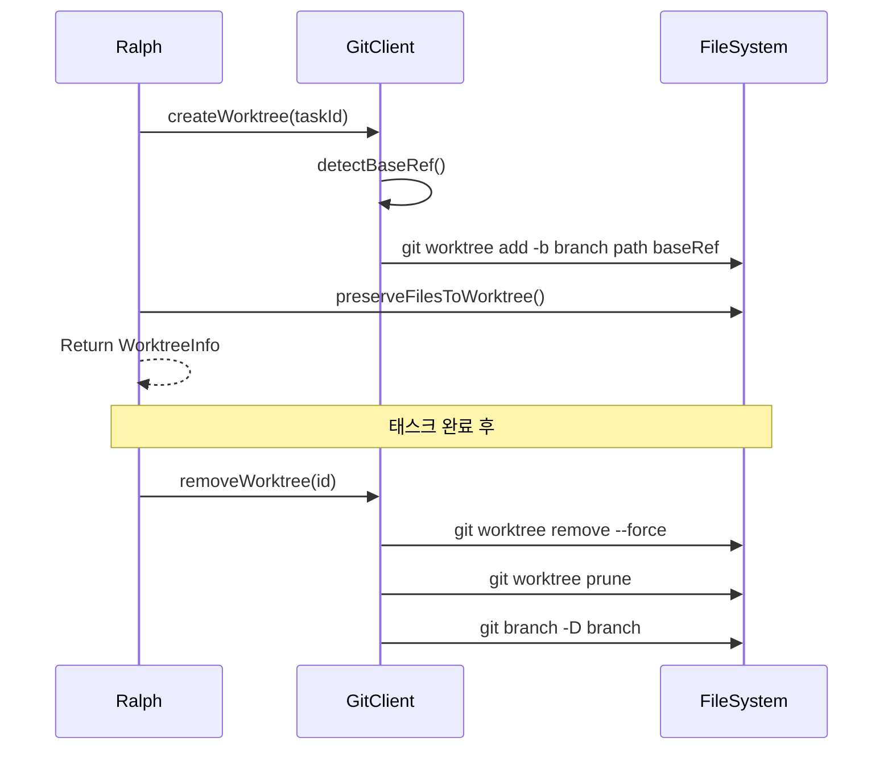

# Phase 8: Worktree Manager

> 📌 Part of [Phase 7-13 구현 명세](../phases.md)  
> 관련 스토리: US-002, US-003, US-007

Git worktree 기반의 격리된 작업 환경 구축

---

## 핵심 설계 원칙

1. **완전한 격리** - 각 태스크는 독립된 worktree에서 실행되어 충돌 방지
2. **환경 파일 보존** - `.env`, `.npmrc` 등 필수 설정 파일 자동 복사
3. **자동 정리** - 태스크 완료 시 worktree 및 브랜치 자동 삭제

---

## 디렉토리 구조

```
lib/
└── worktree/
    ├── index.ts                 # 메인 export
    ├── types.ts                 # 타입 정의
    ├── worktree-service.ts      # 핵심 서비스
    ├── git-client.ts            # Git 명령 추상화
    └── preserve-files.ts        # 환경 파일 복사
```

---

## 주요 컴포넌트

### 1. WorktreeService

Git worktree의 생성, 조회, 삭제를 담당하는 핵심 서비스.

```typescript
export class WorktreeService {
  async createWorktree(taskId: string): Promise<WorktreeInfo>;
  async removeWorktree(id: string): Promise<void>;
  async listWorktrees(): Promise<WorktreeInfo[]>;
}
```

**Worktree 생성 흐름**:

1. 고유 브랜치명 생성: `{prefix}/{taskId}-{hash}`
2. `git worktree add -b <branch> <path> <baseRef>` 실행
3. 환경 파일 복사 (preserveFiles)
4. WorktreeInfo 반환

### 2. 환경 파일 보존 패턴

기본 보존 패턴 (`.ralph.json`으로 커스터마이징 가능):

```typescript
const DEFAULT_SETTINGS = {
  preservePatterns: [".env", ".env.local", ".env.*.local", ".envrc", ".npmrc"],
  excludePatterns: ["node_modules", ".git", "dist", "build", ".next"],
  branchPrefix: "ralph",
  worktreesDir: ".ralph/worktrees",
};
```

### 3. 프로젝트 설정 (.ralph.json)

```json
{
  "preservePatterns": [".env.production"],
  "branchPrefix": "feature",
  "worktreesDir": ".worktrees"
}
```

---

## Git 명령 흐름



---

## 안전장치

1. **메인 저장소 보호**: 메인 worktree(프로젝트 루트)는 삭제 불가
2. **ID 기반 식별**: 경로의 SHA-1 해시를 ID로 사용하여 고유성 보장
3. **Prune 자동 실행**: 삭제 시 stale 메타데이터 자동 정리

---

## 테스트

```bash
# Worktree 테스트 실행
npm run test -- src/lib/worktree/
```

**테스트 커버리지**:

- ✅ Worktree 생성 및 .env 파일 복사 확인
- ✅ Worktree 안전 삭제 확인
